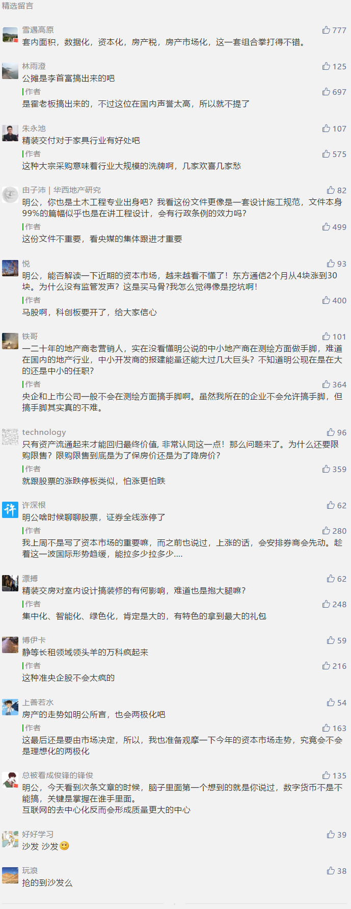

##正文

近日，住建部官方发布了一系列征求意见的通知，其中《住宅项目规范》中，明确指出了“住宅建筑应以套内使用面积进行交易。”

这意味着，全球最后一个公摊面积还计入房屋面积的国家，终于将成为历史。近年来舆论密切关注的“买100平米房子只得70平米”现象也将终结。

说起来，套内面积是一个只有中国才有的“中国特色”，最早是由香港地产商搞出来的。

而在改革开放后，我们在探索福利分房之外的供应模式时，香港这个链接世界的窗口，自然也成为了我们的导师。商品房政策上从招拍挂到预售，再到分摊面积，几乎是全盘照搬了香港模式。

因此，在享受了香港模式的带来的巨大红利同时，各类港式弊端也随之而来，尤其是高昂的房价，成为了无数年轻人的剧痛。

而此次终结套外建筑面积，改为套内使用面积面积，一方面让很多人看到了房价下跌的希望，另一方面很多专家也站出来说改变计算模式并不能影响总价。

那么，这则规定究竟会如何影响房价呢？

这个问题既复杂又专业，解释起来会有点麻烦。

不过，作为我的老读者，应该会掌握一门技术，对于自身不了解的领域，最简单的方式，就是“看专家们的屁股”。

毕竟，话可以随便说，但身子是不会说谎的。

因为，任何一个政策，积极推动他的，必然是最大的受益者；反之，积极阻碍他的，必然就是最大的受害者。

这里呢，举两个现实的例子。

2002年，黄奇帆到了重庆，就率先把重庆的房地产按照套内计价进行改革，后来呢，其主政期间重庆的低房价成为了全国的一朵奇葩。

而在2016年12月30日，黄市长在早上卸任，都没撑第二天，重庆房地产协会下午就起草了恢复按照套外建筑面积计价的建议，交到了市政府......

可想而知，地产大佬们等这一天等的多辛苦。

 

而另一个相反例子，是2010年，香港立法委建议，在新房买卖中，去掉套外公摊面积，按照套内使用面积定价。

随后，在香港官方咨询公众意见中，反对意见特别巨大，一波波的地产大佬和业内专家站出来炮轰香港当局，坚持应该按照套外建筑面积交易。

大佬们的御用人文们，把理由也编织的合情合理，仿佛一旦去掉公摊面积，就会引发巨大的混乱和社会动荡。

后来地产大佬们发现顶不住，还搞起了“抻”字诀，提出“统一建筑面积的方法”，想尽各种办法拖慢立法进程。

一直拖到2013年执行取消公摊，大佬们口中的混乱也没有出现，嗯，不断飙升的房价反而得到了遏制。

所以呢，对于自己不懂的领域，可以多学学毛教员：凡是敌人反对的我们就要拥护，凡是敌人拥护的我们就要反对。

从屁股上就能看出来，对于按照套内面积计算最害怕的就是地产商。毕竟，公摊计入房屋面积这种“中国特色”，就是他们研究出来的。

简单说呢，按照套外计算，拥有分配权的开发商就掌握着主动权，成为卖方市场，而一旦按照套内计算，拥有选择权的消费者就掌握着主动权，成为买方市场。

因此呢，对于改为套内使用面积销售，为开发商和炒房的，自然就要坚决的反对，对于买房的住房的就要坚决的支持。

嗯，并不需要去研究里面复杂的机制。

那么对于房价的影响呢？

其实这是一个非常复杂的系统，且不说全国数以亿计的消费者，中央监管部门、地方政府、银行、开发商，每一个环节能摸入门就已经很了不起了，更不要说将其融会贯通。

因此，对于超级复杂的系统，最好还是找一个相似的系统，这样就能够在不理解的情况下，依然得到答案。

而房地产市场在中国，最类似的莫过于股票市场，因此两者对比，往往能够找到一个相近的答案。

虽然套内和套外看起来只是一个计价的模式，但是按照过去的套外计价，开发商就能搞出大量的猫腻，联合测绘公司偷面积以及把分摊的公共面积再销售，都是很多中小开发商的惯用伎俩。

这些猫腻对于刚要买房的小白，和初入A股市场中的韭菜一样。买房子送车位和A股的高送转类似，都特么的羊毛出在羊身上，大家却乐此不彼。

而随着国家将套外建筑面积统一归口为套内使用面积之后，就像资本市场开启严格监管一样，信息越来越公开，过去的很多猫腻就无法再玩了，这将导致大量依赖于猫腻存活的中小开发商越来越艰难。

虽说是良币驱逐劣币是对大开发商的利好，但而因为中小开发商的艰难，也将导致整个市场下行，资金面看空，使得很多好的大开发商的估值也被“错杀”。

所以，某种程度上来看，资本市场这去年也给房地产市场先干为敬，打了一个样。

而且，从最近几年农村的土地确权来看，此次城市房屋的套内面积本质上都一样，就是**确定产权**。因为，**权力和义务未来一定是要相匹配**的，套外面积大家都没用，收房地产税肯定是不合理的。

更不要说，过去的套外计价，使得整个房地产市场因为分摊率的不同，被割裂为无数的相互无法打通的小市场。而如今，随着改为套内面积计算，将使得整个市场连通起来，**不仅能能够更好的数据化，还能够更好的资本化，以及在市场化流通。**

而且，说到流通，本次规范还有一个重点，就是未来房屋要“精装交房”。由于开发商的装修周期要远短于个人，这会直接使得大量房屋进入使用市场，从而在供应端，短期迅速提升了住房的实际供应量。

而且，“精装交房”将非常有利于房屋进入租赁市场，过去很多投资客手握毛坯房，不愿意花钱装修去租赁，认为租金不够支付装修费的。而如今，很多投资客面对“装都装了”的房子，很容易将其放到租赁市场。尤其是在未来房地产税的压力之下。

可以预见的是，这一套政策组合拳下来，最大的目的，还是向市场上供应更多的住房，让市场的手来平衡房价和租金。

而如今国家大力推动的长租市场，某种程度上看，也是房地产领域的一种“科创板”，未来也会调动更多的国家资本往其中投入。

在长租市场的推动下，未来全国的房价，也会像科创板推出后类似，**有可能将导致主板的两级分化。**

因此，从宏观上来看，未来无论是房地产市场和资本市场，都会向着更加市场化的方向发展，让资产流通起来，最终回归真实价值。

所以，想要明白自己手握房产的走势，也许，今年的资本市场就会给我们答案。

##留言区
 

