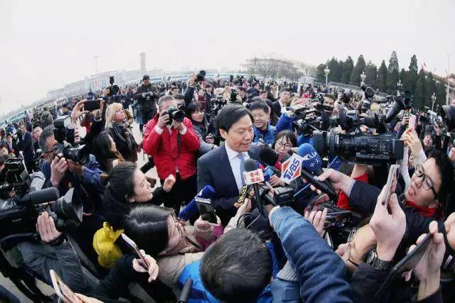

##正文

昨天，澎湃新闻发布了两则地产重磅消息。

一则是恒大许家印召开全集团营销会，宣布旗下执行住宅9折，商铺8折优惠，接下来每周都将召开集团营销总结会，亲自落实各单位情况。

另一则是今年开工以来，碧桂园频频受“裁员”困扰，有部门裁员幅度至50%，涉及的范围相较于以前更广，从总部到区域，幅度也更大。

在即将召开重要会议之前，澎湃针对中国房地产的Top2，同一天发布“不利新闻”，恐怕并非巧合。

毕竟，过去频繁参会的地产老板们，如今都被科技大佬们取代了。

 

记得2018年年中的时候，我提出过一个判断。2019年开始，中国将由“货币去杠杆”转向“财政去杠杆”。

而沿着“财政去杠杆”继续推导，也得出了19年地产商的日子会**非常困难**，同样也是一二线**刚需**上车时间的结论。

当然，“财政去杠杆”这个判断从提出之初，就被广为诟病，尤其是随着央行接连的“放水”，越来越多的人都对此表示质疑。

不过，进入2019年之后，大家发现随着在银行利率不断下行，房地产融资成本却屡破新高，在资金极度紧张之下，甚至像中民投这种“资本家联盟”，都不得不“断臂求生”，出让黄金地块董家渡。

原因只有一个，那就是**“双轨制”之下，“金融去杠杆”结束了，“财政去杠杆”开始了。**

如今，在“财政去杠杆”之下，国家死死的按住了以棚改为代表的基建投资，也遏制住了资本进入房地产开发市场。

资本也厌恶真空，“货币去杠杆”停止，带来的巨大货币，自然就涌入了国内的资本市场，在国家还没有开放杠杆的情况下，以妖股东方通信为代表，大量国资背景的概念股不断的被拉涨停。

仿佛15年的牛市又要来了。

 

当然，历史是有借鉴意义的，未来房地产市场以及资本市场的走势，其实完全可以从2015年的那一波地产和房价走势中寻找逻辑。

2014年，中国确定了创新驱动战略，因此，在推动创新的大背景之下，国务院开启了大规模的放水，期望推动中国经济的跨越式发展。

在这一轮的经济刺激之下，中国爆发了移动互联网的浪潮，不仅阿里、腾讯、华为等企业迅速做大做强，也诞生了小米、滴滴、美团、头条等大批的独角兽企业。

但是，当时的经济放水，并没有锁死房地产，因此，国务院释放出来的资本，不仅带动了股市冲破5000点，也拉动了全国二三线城市房价的翻倍的往上涨，收益远比股市高得多。

因此，如果对比两轮的经济刺激政策，就会发现，如今在刺激之前，就明令禁止，要求“房住不炒”，锁死了资本流向房地产市场。

嗯，“房住不炒”这条红线的背后，也就意味着，另一些东西，是可以炒的。

因此，某种程度上来看，正是锁死了房地产和基建，才**让释放出来的流动性，集中在资本市场这一个点之上**，避免了“其始误于隆中对，千里之遥而二分兵力”的故事。

而在这个基础之上，展望未来的资本市场，就会得出很多有意思的结论。

2014年和2019年，国家主打的都是创新，不过，支持创新方向从针对存量的共享经济，转向了针对增量的物联网，执行的主体从战兴板变成了科创板。

因此，上一轮的教训本轮也会被铭记，一方面不会让宝贵的资金再流向房地产，另一方面，不会允许在科创板（战兴板）推出之前，A股就已经坐完了“过山车”。

这也是为什么我在春节前后几篇文章中反复说的，接下来这段时间，是资本的春天而不是散户的春天。

因此，在未来伴随着科创板的推出，中国一波人造牛市成功的话，那么不仅普通的民众也能从资本市场获利，未来势必还会出现一批超级“跨国”巨头。

这就像2015年左右，万达和乐视们在A股的牛市以及战兴板的预期之下，开启大规模的海外并购一样，不出意外随着科创板的开设，也将会出现一大批新的符合政策导向的“并购狂魔”。

所以，无论是企业还是个人，在今后这几年选对方向真的很重要，尤其是准备在资本市场发家的朋友。

 

而房地产市场，在接下来几年却是另一个样子。

锁死房地产融资，甚至财政去杠杆的本质，就是要避免放出来的水，没有去搞创新，却又涌入了房地产和基建市场，搞的民怨四起一地鸡毛。

因此，未来“货币稳杠杆”和“财政去杠杆”，就成为了“双轨制”，资本市场的老板们未来两年吃香喝辣，而房地产老板们还要再吃两年的“土”。

未来就像之前钢铁和煤炭行业去杠杆那样，大量不合规的，规模不够的房企会慢慢的被重组，形成一大批的超级房企。行业集中度迅速拉升，形成一批巨无霸级的企业。

就像中民投的董家渡卖给绿地，万达乐视的土储卖给融创那样，真别觉得恒大八折和碧桂园裁50%就觉得人家不行了，未来恒大和碧桂园两位“爸爸”的快乐，你想象不到.....

 

而且，按照科创板和人造牛市取得成功，那么在中国经济高速增长之下，过去几年的房价泡沫，基本上就被烫平了，也就实现了房价的软着陆，这些巨无霸企业们的资产将变得非常优质。

更不要说，随着科技创新带来的产业巨变，一方面，**汇聚人口的中国一线城市群，未来经济会高速发展，向发达国家看起**。另一方面，也会像两次互联网革命那样，**在一线城市群中，诞生一大批金融与科技方面财富集中的新阶层。**

毕竟，随着未来5G和物联网的发展，一栋写字楼内的公司，可能就会垄断国内一个巨大的市场，未来在科技的推动之下，财富的集中度会越来越高。

因此，只要科创板最终取得成功，那么一线城市群的黄金地段的房价，未来仍会存在上涨空间。这也是为什么主要三四线布局的恒大和碧桂园，如今都在加速去货和控成本；而一二线布局的万科一边喊“活下去”，一边又拼命拿地的原因。

嗯，这也是我去年说22块钱的原因之一。

最后，不要脑子一热就以为自己是许家印或者徐翔。无论房地产还是股市，资本与散户之间的操作，往往是相反。

资本积极过冬的时候，往往是散户应该上车的时候。而散户全部都在拼命上车的时候，资本往往都在撒欢跑路。

 

 近期关联文章：

资本市场的意义 （解释为什么中国要打造强大的资本市场）

中国未来的两大机遇 （解释什么是财政去杠杆）

##留言区
 

