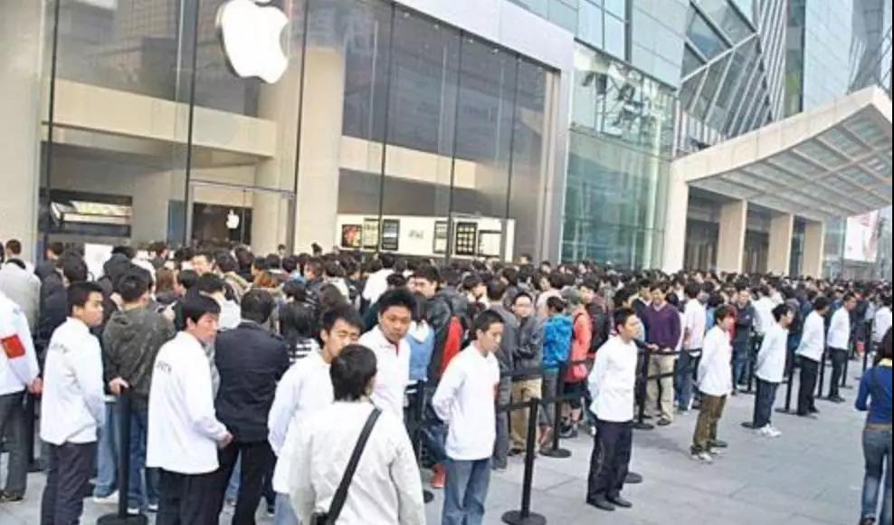
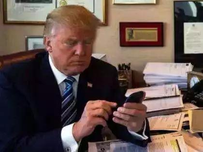
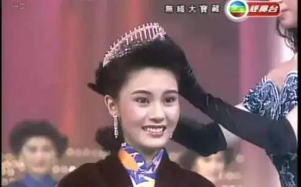

##正文

今天，美国参议院通过决议，取消特朗普在美墨边境实行的紧急状态。

不出意外，特朗普随后也将动用自己的否决权，否决美国国会对他的否决，开启一场“冲冠一怒为修墙”的撕逼大战。

如此大规模的撕逼在美国历史上都很罕见，很多人都把特朗普的“任性妄为”归结于其性格。

不过呢，个人奋斗背后往往也隐藏着历史的进程，换个角度来看，**并非是特朗普的撕逼改变了历史，而是历史选择了撕逼的特朗普。**

因为，每一次美国总统与国内建制派大撕逼的背后，都伴随着通讯科技的大规模变革与进步。

而这种大变革，最近一个世纪以来一共出现了三次。

第一次大变革，是无线电收音机的普及。

1920年，美国第一家商业电台向民众开播，随后，人们对信息压抑百年的渴望如黄河泛滥一发而不可收拾，短短2年间电台就以惊人的速度增长到了500家，几乎每家电器商行门前，就像九十年后的中国苹果店那样，排起了长长的队伍。

 

而随着通讯技术的普及，美国国内的权力体系发生了重大而深远的变化。

在此之前，摩根家族在美国金融、钢铁、铁路、军工等诸多领域都占据举足轻重的地位，凭借其庞大的能量和垄断地位，不仅是当时的“无冕美联储”，家族还能够决定美国总统的人选，对于某些不配合的总统还能直接干掉。

而通讯技术的发展，迅速打破了摩根家族的权力垄断，能够通过无线电与民众联系的美国总统，不再是资本家背后的牵线木偶，罗斯福以“炉边谈话”的形式，用收音机作为“推特”，迅速把美国人民变成了他最强大的武器。

在民意的坚定支持下，罗斯福不仅带领着美国走出大萧条和打赢二战，还在任期内将巨无霸的摩根银行拆分成海外业务、商业银行以及投行三家公司。

可以说，正是无线电技术，将信息打通，使得某个超级财团垄断美国的权力的日子一去不复返。

第二次大变革，是电视机的普及。

从1950年到1960年，十年之间，美国的电视机持有量从100万台迅速提升至3000万台，约有87％的家庭拥有至少一台电视机，这十年之间，当年街头排队买收音机的场景，变成了电视机，再一次出现了......

而就在电视机完成对美国家庭普及的那一年，尼克松与肯尼迪开启了总统大战。

历任两届副总统的尼克松，在广播演讲方面滴水不漏堪称完美，而肯尼迪就像如今的特朗普一样，作为花花公子不仅绯闻缠身，而且其土壕的身份更是令很多人不喜，但是电视的出现，让表演张力极强的他迅速获得了电视观众的支持。

虽然广播选民将选票多半投给了尼克松，但是凭借着电视选民的坚定支持，“花花公子”肯尼迪战胜了政坛老将尼克松。

而凭借着电视获得美国民众坚定支持的肯尼迪兄弟，也像罗斯福叔侄那样，搞起了反建制派的路子，一方面推动黑人的人权（《绿皮书》里面的那个司法部长就是肯尼迪总统的弟弟），另一方面试图终结越战。

越战能为军火寡头们带来数不清的利润，黑人也能为农场主们提供廉价的劳动力，肯尼迪兄弟这么搞，自然触碰了利益集团的巨大利益。

可惜，肯尼斯没有罗斯福那么好的运气，有着小胡子的“神助攻”，卷入第二次世界大战，于是电视机达人的肯尼迪兄弟，就先后死在了战争之王的子弹之下。

 

所以呢，从某个角度来看，声称要解密“刺杀肯尼迪”的特朗普，在全球“碰瓷”，或许也是一种智慧。

而从通讯技术升级的角度来看，收音机普及之后，美国总统普遍音质都一流，而电视机普及之后，美国的总统非高即帅，甚至还选了里根这种大屏幕的演员，这就是通讯技术变革的威力。

第三次大变革，是移动互联网的普及。

进入21世纪，美国群众从排着长队买收音机、电视机，变成了买手机之后，总统与选民的沟通，从收音机、电视机，变成了如今的手机。

美国的两位总统奥巴马和特朗普都是移动互联网达人，相比于他们还专注于电视宣传的竞争对手，各种社交软件玩的一个比一个溜。

 

大家都习惯了特朗普是推特达人，其实其奥巴马也不逊下风，2017年奥巴马有三条推特冲进了最高转发量的前十名，其中一条高居点赞数榜首。

可以说，正是科技的变化，使得美国的游戏规则发生了本质的变化，能够利用新媒体的人往往容易取得最终的胜利。**如果明年民主党不能选出来一个擅长新媒体的，多半是要输给特朗普的。**

而同样，每一次通讯技术带来的变革，**会使得新上来的总统和总统候选人更贴近民意并强烈的反对建制派，打破原有的平衡。**

从收音机之王罗斯福拆分金融寡头的摩根，到电视机之王肯尼迪试图终结军火巨擘的越战，再到推特之王的特朗普拼了老命要建边境墙，本质都是在科技为总统们带来了广泛的民意支持，使得他们敢于硬怼建制派们。

甚至说，只有对抗建制派，才能为他们带来更广泛的民众支持。

这也是为什么特朗普“冲段一怒为修墙”，因为他明白，只要坚持修墙，他就能够获得选民们最坚定的支持来获得连任。

而从这个角度来看，特朗普昨天硬顶着美国政府勒令波音停飞也是这个道理，毕竟，得罪波音背后的大佬和讨好美国全国坐飞机的民众之间，对于接下来准备大选的特朗普来说，并不难选择。

无线电到电视信息的升级，将信息的传递更加立体；而电视到移动互联网的升级，将信息的传递更加及时，不需要再在显示器前坐着，就可以随时随地都可以接收信息。

通讯技术的发展，使得总统能够越过“中间商”随时随地跟民众联系，这也使得这一百年以来，美国总统的权力变得越来越大。

同理，大家经常吐槽的港姐选举，如今几乎变成了选丑大赛，也通讯科技发展的原因。

80年代前后，港姐鼎盛时期，从中诞生了一大批超级美女，是因为那时是电视机和电影的时代，信息传播模式是单向发散式的，几家少数的电视台和影视公司垄断了整个香港民众的娱乐生活和信息获取通道。

这也就使得，当年通过电视全港播放的港姐选拔，成为香港美女们几乎唯一改变命运的通道，像李嘉欣这样的美女想要搏一把改变命运嫁入豪门，就只能去参加港姐的选拔。

 

而随着双向沟通的移动电话以及互联网的普及，美女资源迅速市场化，打破了港姐选拔的垄断，美女们有更多的渠道改变命运，也就没必要去参加港姐的选拔。

甚至随着大陆90年代末互联网的蓬勃发展，不再依赖香港的文化输入后，香港的电影随后也就没落了。

从这个角度来看，无论是玩推特的特朗普当选和强势反建制派，还是当年香港小姐和香港电影的没落，背后都是通信技术的换代式提升，推动了媒体的融合发展以及资源的自由流动，引发的巨大变革。

而随着如今5G的大规模推进，我们也将迎来这个变革的大时代。

##留言区
 

