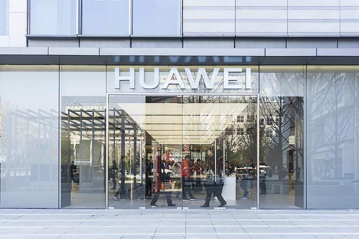
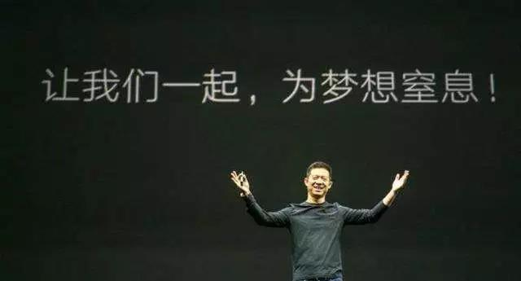

##正文

 

在就前不久的AWE上，余承东还表示，华为不会做传统电视，永远不做家电智能硬件，不会和传统家电企业竞争。

而今天大量媒体报道，华为将在下个月推出电视产品，采用了50吋和65吋的屏幕，并且会有双摄的设计。规划一年销量达到1000万台。

嗯，真香.......

 

说起来，华为做电视并不奇怪，但是这预估的销量蛮吓人。

2018年全国彩电销量才4700万台，同比增加仅有0.5%，但1500亿元的零售规模，却同比下降8.6%，可以说这是个严重饱和甚至衰退的市场。

而1000台的华为第一年就要吃掉国内市场20%以上的份额.......嗯，贾跃亭当年都没敢这么吹牛逼。

 

而且，从披露的数据来看，华为此次推出的产品一色为50-65寸的中高端产品，因此反算过来，华为一家就要吃掉2018年中国电视市场1/3左右的销售额，这意味着整个行业都将进行一次大地震。

很显然，靠着自然增长和市场的力量，哪怕华为帅如阿汤哥，也不可能完成这样“不可能完成的任务”。

 

那么，华为的背后有着什么样的算盘呢？

我在2017年“卫国战争”系列中有过一个判断，进入中期的僵持阶段，我们将启动大规模政府补贴的“新家电下乡”。

只要政府带头启动“新家电下乡”，必然会引发整个电视行业的大规模产品更迭，撬动目前电视行业这潭死水，带来巨大的增量。

假如未来以旧换新的补贴，是针对用非智能家电更换智能家的话，那么华为一年1000万的“任务”，说不定还真就能完成了。

所以，华为大概率也会延续自身荣耀和华为的双品牌路线，一个主打50寸的普及型市场搭乘政策的红利，一个主打65寸以上的高端市场，趁着政策的红利，很可能会来一波华为浪潮。

甚至从这个角度来看，孙宏斌最近几个月大规模的对乐融超级电视改组，也将于今年春季推出第五代智能电视，恐怕也是盯着这一波的顺风车。

唯一比较可惜的，是2013年就搞智能电视的贾跃亭，没有等到2019年的这个春天。

 

但是还有一个问题，华为作为一家高利润的科技公司，不可能去跟一群不赚钱的制造业企业打价格战，这样会直接拉低公司的利润，总不能真跟小米一起拼5%的路线吧？

而且，按照常理，搞智能电视是需要内容的，当年贾跃亭可是自建了一个乐视网买了一大堆的版权，而华为跟如今的几大内容商均没有什么深度合作，接下来会怎么搞呢？

其实，我们不能用4G时代的思路，去玩5G时代的游戏，内容是4G时代的玩法，华为这次推出的电视，必然是5G时代物联网的玩法。（从这个角度也能推测，孙宏斌很可能对乐视网接下来兴趣不大）

就像我去年写5G物联网系列文章时候说的，未来5G的博弈重点不是存量的手机，而是增量的其他智能设备。

>一旦大量的人们日常使用的物品，被接入互联网之后，那么70亿人口的信息交互，就不再是互联网的上限，数以百亿千亿万亿的“消费”会互联互通。
>《未来十年最后一次的财富周期》

华为的电视也许还真不是个电视，巨大的屏幕将成为一个家庭的娱乐中心或者说是智能控制中心，成为一个物联网时代的虚拟管家。

 

 

届时，华为将通过麒麟OS系统为中心，自身云服务、AI芯片等一系列能力，通过智能电视与家庭内的物联网设备相连。

因此，如果我没猜错的话，华为搞电视大概是个虚招，本质应该是要卖研发已久但是却迟迟未推出使用的麒麟OS系统。

就像移动互联网时代，苹果和谷歌，利用移动端系统对微软垄断的桌面进行弯道超车那样，在5G物联网时代，华为也可能借助麒麟OS系统，对安卓和IOS系统进行弯道超车。

所以呢，如果从操作系统为主的角度上来看，华为就真的不需要有像贾跃亭那样大规模的购买版权，直接像谷歌一样搞开放系统就好了。

因此华为未来大概率还真不会跟那些电视生产商们去直接竞争，而是将用操作系统对他们进行“赋能”。

嗯，简而言之，颇似阿里菜鸟与四通一达的关系，利润我来赚，苦活你来干，嗯，但是我也得先给你们做一个标杆。
 
 

但是，依靠电视这么一个薄利的行业，华为的操作系统未来能挣钱么？

大家不要低估科技代差带来的冲击，就像大家耳熟能详的那个段子，柯达直到倒闭的那天，胶卷技术都完美的令人惊叹，可还是败在了新生的数码相机的手里。

20多年前，走到走在大街上总能看到遍地卖VCD碟的小贩，成本几毛钱的光盘往往要卖到10块甚至20。而20年后的移动互联网时代，当年一张光盘的钱，购买力足够买优酷腾讯爱奇艺一年的会员。

于是，不用城管，在互联网的打击下，街头卖光盘这个行业也就消失了。

从VCD到DVD再到蓝光，光盘的科技升级不可谓不快，但是在网络通讯技术发达的今天，打败他们的并不是钻研技术的同行，而是新一代的技术。

所以，5G物联网时代怎么赚钱，不能用4G时代的思维来考虑，对此，我们可以拿游戏举个例子。

由于5G时代的数据高传输和低延迟，因此华为电视完全可以连在华为云上面进行处理，届时我们玩所有的游戏大作，只需要一台华为电视，都不再需要发烧级的电脑配置，甚至也不需要去下载。

这样不仅避免了目前吃鸡类游戏大规模的作弊，让游戏更加公平，更重要的是让游戏、社交和休闲连为一体。

随着5G时代的推进，低延迟的网络之下，完全可能做到电视+游戏+直播一体，用华为电视看游戏直播的时候，可以说一声“小艺，我想玩这个”，1秒内就可以进入游戏，不需要购置高昂的游戏设备和漫长等待，上手就能玩。

甚至一场直播的王者荣耀中，正在智能电视前观看直播的观众，可以瞬间切入到游戏中，跟偶像们一起驰骋沙场，也可以一群朋友在直播中的某个赛点读取云存档（副本），选择接着打去改变历史。

所以，某种角度上看贾跃亭的超级电视没有撑到春天，关掉熊猫直播的王思聪也没有撑到春天。

更不要说未来可能普及的AR和VR设备，以及大量的商用与家用物联网终端，未来可都是要对接一个操作系统的。

如果华为的麒麟OS系统真做到了这一步，确定了标准，可能就会像移动互联网时代，谷歌和苹果的移动系统对微软桌面系统的降维打击一样，出现真正意义上，掌握着底层结构的超级巨头，届时将有百倍于如今安卓系统的终端向这个系统接入.......

而这个掌握着5G物联网时代底层架构的超级巨头，是我们中国的公司！

所以，话都说到这份上了，等今年华为智能电视出来的时候，咱能不买吗？

##留言区
 

