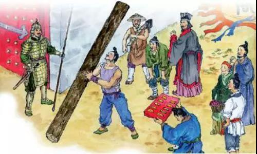
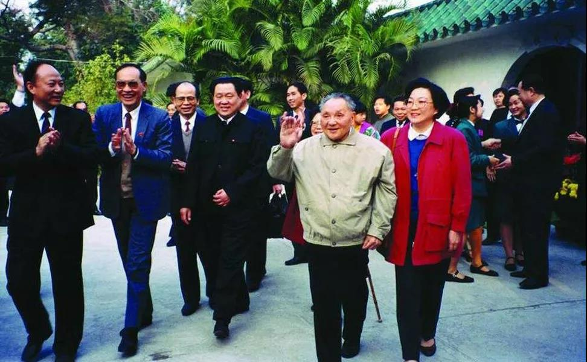

##正文

从去年12月阿根廷G20会议后，我开始了一系列的“新基建”文章，从投资、股票、房地产甚至虚拟货币等不同的角度，描绘了一波如何跟着“新钱”们上电梯。

随着昨天，上交所受理9家科创板企业，科创板问世在即，我想，也应该对这个新基建系列文章，做一个阶段性的总结了。

我对科创板的定义，和雄安类似，是80年代的深圳和90年代的浦东，虽然目前看起来“平平无奇”，但是却肩负着历史的使命，因为**这里将是中国新一轮改革开放的发动机。**

这么说会有人觉得很奇怪，说起科创板背后的资本市场，大家第一反应都是去西方找经验。

但是介于中西方的体制差别，资本主义往往习惯于通过一轮轮的经济危机来推动改革和进步，而中国历史上往往习惯于通过由上而下的改革来实现发展。

因此，只有把科创板与中国的改革放到一起，大家才会寻觅到其中的巨大意义。

在中国的历史上，自周公的封建制改革，商鞅的军功制变法，隋唐时期的科举制改革，到80年代的联产承包制，到90年代的社会主义市场经济，**所有成功的改革都有一个共同点，就是在变法的过程中，打造了一个“新钱”阶层。**

反之，所有未能缔造“新钱”阶层的变法，毫无疑问通通都失败了。

原因很简单，介于中国历史上庞大的人口规模与广阔的疆域，任何变法要面对的都是一群无比强大的既得利益集团。

譬如，在周公变法的时候，时时准备复辟的殷商遗民占据了全国绝大部分人口和土地；在商鞅变法的时候，秦国的满朝公卿几乎全部反对；隋唐推行科举制时期，中国“五姓七望”的门阀势力正值鼎盛时期......

但是“新钱”们的涌现，改变了势力的对比和历史的进程。

周公改制带来的封建集团，商鞅变法带来的军功集团，科举制度带来的士人集团........这些“新钱”们作为先进生产力的代表，在顶层的改革者的支持下得以迅速发展，而他们发展起来后，又对顶层的改革者提供巨大的支持。

而且除了对改革者提供支持之外，更重要的是他们推动了生产力的发展。

封建集团推动井田制，军工集团推动土地私有制，士人集团推动均田制......这些“新钱”通过土地改革推动生产力迅速提升，使得“老财”们在利益驱使下，也不得不转变态度迎接改革，哪怕是商鞅被秦惠王车裂之后，商鞅的变法依然被保留下来并继续推进。

所以，看中国如今新一轮的改革，再看科创板就会明白，面相未来十九大报告中生产力方向的**科创板，本身就是划出了一块试验田，来创造一批“新钱”阶层。**

而随着“新钱”阶层在制度性红利的扶持下，迅速作大做强，不仅会倒逼过去躺着赚钱的“老财”们站起来改革（碧桂园搞机器人，恒大搞电动车，融创搞智能电视等），也会倒逼原本很多不愿改革的既得利益集团进行体改（A股缺乏的注册制、退市、做空、券商看空等）。

毕竟，“摸着毛熊尸体过河”的我们，在看过东欧剧变之后就会明白，戈尔巴乔夫在经济改革遇到阻力之后去转向体改，那可是血淋淋的教训。

接受了毛熊教训的我们，后来都是先通过经济改革，带动经济发展形成“新钱”阶层之后，再为高速发展的经济和新钱阶层来匹配体改。

所以，即将启动的**科创板肩负着制造出大量的“新钱”阶级和继续推动中国改革的使命。**

因此，根据中国古代“千金马骨”、“徙木立信”的历史，甚至可能会让大量第一波参与的人，赚到超出他们预期的利润。

 

而且，根据中国历代的改革经验，此次科创板很容易取得成功。

因为**中国改革开放历史上任何成功的经济改革，都是集中在一个点上形成突破**，无论是80年代的深圳，还是90年代的浦东，都是在庞大的既得利益集团之外，画出了一个圈。

这就像最近一个月某些不停拉涨的小盘股背后，仅仅是集合几个游资之力。那么在中国政府巨大的能量之下，只要避开了既得利益集团的阻碍，把力量集中在一个点上，当然就可以通过“举国之力”迅速推动成功。

这是中国改革成功的秘诀。

而反过来看，近年来无论是遍地开花的自贸区，还是15年启动的大牛市，那些试图全面推开的改革，往往很难取得理想的成绩。

一方面，庞大的既得利益集团会迅速吸干改革的红利，将改革扼杀在摇篮里面，就像15年战兴板还没推出来，大家就把牛市炒就过去了，只留下一地鸡毛。

另一方面，无论是集结了中国金融工业几乎所有权重单位的A股，还是包含了几乎所有中国经济发达地区的自贸区，都已经占据了全国最主要的资源成为庞然大物，因此国家即使再怎么投入资源，也不会出现大规模的提速。

所以从这个角度，就会明白，国家为什么一定要另立山头“画个圈”，搞一个**“小而美”的科创板。**

最近十余位朋友问我，其公司是否应上科创板，我都给予了非常坚定的回答。因为从中国新一轮改革的角度来看，**科创板就像当年的深圳，必然会缔造大量的“新钱”阶层，而有了这些“新钱”，才能推动未来的改革。**

这就像1979年在画下的“一个圈”，深圳、珠海、汕头和厦门四大特区，虽然对全国抽血，但只要有一个真正崛起了，有了经济上成功的样板，接下来就会迎来1992年社会主义市场经济制度性的成功。

 

这就是科创板的必要性！

所以呢，这一次类似于80年代深圳、90年代浦东，国家启动改革大潮背后带来的历史性机会，“老财”们可以不重视，但是普通人必须重视，因为**这是未来十年上车成为“新钱”的最好机会。**

毕竟，个人的奋斗背后，也要看历史的进程。

当然，介于自身情况上不了车的，依然可以抓住这个机会，毕竟一群人挖金子暴富的时候，也有人可以靠卖铁锹赚钱，说不定比那些没挖到金子的人赚的更多。

##留言区
 

