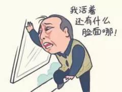
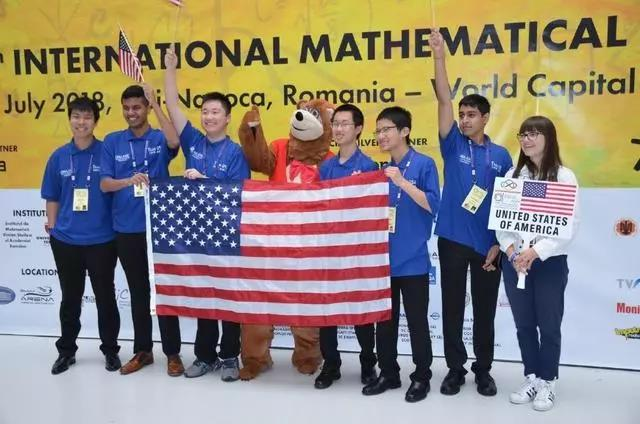

##正文

 
一

昨日上午，东莞公安的一则微博，在P2P网贷行业中引起了轰动：P2P的头部玩家团贷网，其实际控制人唐某、张某主动向东莞市公安局投案。

随后，与团贷网关联的上市公司派生科技发布公告，公司实际控制人唐某，董事长张某被公安机关采取强制措施，公司即日起停牌。

团贷网这家控制上市公司并获得较高评级的P2P，一夜之间突然变成了“非法吸收公众存款”，引起行业一片哗然。

不过呢，大家也不要觉得意外，团贷网的此次主动投案并非巧合，而是继去年六月之后的那一轮的P2P爆雷之后，新一轮的P2P“供给侧”正在推行。

其背后的原理并不复杂，如果回顾历史，会发现P2P与08年为抵抗次贷危机而启动的“四万亿”有着巨大的关系。

当年各大国有银行的开闸放水，所有的企业都能轻松从银行拿到贷款，甚至有的企业不需要贷款，银行也会主动提出增加授信。其直接结果，就是国内出现了产能的井喷和一片泡沫吹起来的繁荣。

而随着美国逐步从国际金融危机中走出来，“四万亿”在2010年底进入尾声，银行贷款开始慢慢收紧，直接导致了08年扩张的产能，逐步出现了银行贷款到期而不再续贷的情况。

因此，对于很多已经走上扩张之路的企业来说，开弓没有回头箭，只能想办法从其他领域融资，甚至很多老板不惜去借高利贷。

而与此同时，四万亿的投资使得老百姓手头迅速富裕了起来，很多人手里都有了大量的余钱。

因此，在资金的供求两旺之下，再加上移动互联网技术的突飞猛进，P2P这个行业也就应运而生。

但是，随着P2P的也蛮扩张，问题也就来了，P2P的本质，不仅用的是旧思维和旧模式，资金效率和风控并没有提升，而且投向几乎都是自08年以来的“旧基建”和“旧动能”。

因此，在如今国家准备启动“新基建”，需要强大的资本市场之际。就像种粮食一样，必然要进行宏观上的“去杂草”，因此P2P，尤其是那些做大额信贷的P2P，作为跟“杂草”们输送原料的渠道，规模必然要慢慢的缩小。

所以说，P2P的爆雷与个人奋斗的关系虽有，但决定其命运的还是历史的进程。

 
二

今年开始，随着中国开启大规模的减税降费，算算账就会明白，想要投资新基建，靠清理P2P甚至影子银行的那点存量，肯定是不够分的，必须要搞出来增量。

于是，今天傍晚的一则新闻应运而生，证监会核准设立摩根大通和野村证券这两位超级巨头，可以在中国设立51%控股的子公司，并开展其他业务。

估计随后，瑞士信贷和摩根士丹利这些小伙伴们，很快也将加控股券商快入华的步伐。

虽说这个时间点放行有点做顺水情人的意思，但外资入华对中国的资本市场还是有着巨大的意义。

一方面，他们将利用其经验，帮助中国启动新基建和国企混改，完善资本市场的机制，与国际接轨；另一方面，他们也将利用其渠道，帮助中国的企业从全球市场获得发展所需要的廉价资金。

可以说，我们打开大门相迎，为的就是让他们能够帮我们做增量，帮助我们进行新旧动能之间的转换，对我们有着至关重要的意义。

而对于这些外资来说，此时入华可能也算是他们抓住的一根救民的稻草。

随着美国暂停加息后美债利率倒挂，欧洲各国的工业指数也持续下滑，像08年那样的全球经济不景气的阴云，正在欧罗巴上空徘徊。

甚至今天拿到入华批文的两家，摩根大通今年计划在资产和财富管理部门裁员数百人，野村控股则计划在欧洲和美国的交易和投资银行部门裁员上百人，大家都感受到了一丝的冬意。

而未来可以预见的是，未来启动新基建的中国，将是全球位数不多能够带来经济增长的地区，因此谁能先拿到营业的牌照，相当于是谁就先拿到了船票。

或许未来的世界，就像灾难片2012里面，全世界还得靠中国来造诺亚方舟。

 

 
三

资本市场不仅仅对寒冬有着本能的恐惧，往往也会提前嗅到春天的气息。

1992年的那个春天，小平同志视察深圳发表重要谈话，掀起了中国改革开放的浪潮。摩根士丹利亚洲区负责人，随即给当时建行的副行长写了一封信，提出希望两家能够组建合资公司。

不过，当时央行在国际外汇交易市场上由于不懂套路损失惨重，这位副行长临时被调至央行救火，这个计划就一直拖到了1994年初，那位副行长回来出任行长才得以实施。

于是，中国第一家中外合资的投行，中金成立了。

摩根士丹利原计划中方的员工就是负责搞定监管和提供客户名单，后续事情由美方打包，可没想到我中国自有国情在此，擅长学习的中国员工们很快就完全复制了摩根士丹利的技术和管理模式。

甚至那位建行的老行长还玩起了鹬蚌相争的游戏，随后就引入了摩根士丹利的老对头高盛，让两家美国投行搞起了竞争，纷纷掏出了看家本事。

结果就是教会了徒弟饿坏了师父，在人才的流动之下，国内券商纷纷崛起，利用本土优势，在自身熟悉的环境把老师们打得满地找牙。

 

 
四

20年前，当时的中国需要推动国企改制，以迎接全球市场的竞争。改制的国企对于资金有着巨大的渴望，而当时中国金融业根本无法满足需求。

20年后，如今的中国需要推动国企混改并引入外资，以推动国内的新基建建设和海外的跨国投资，而现在国内的金融业再一次无法满足实体经济的需求了。

因此，就像当年引入外资投行推动金融改革，以此建立起了一大批国内顶尖的大央企，如今我们也需要外资投行在国内开展更多的业务，让中国的企业能够募集到全球的资本，进行全球的投资。

可以说，从逐步遏制P2P和迎接海外投行，对于我们是一种经济基础倒逼上层建筑的改革。

这种改革意味着我们将打开大门，把他们请进来，一边竞争一边学习，凭借着中国人的智慧，把西方先进的东西都吸收过来。

这就像去年国际奥数赛中，虽然美国队再次击败中国荣获冠军，但是六名美国队员中，有四名都是华裔......

 

中国人自古就不怕竞争，也不怕强敌，过去五千年的历史证明了，所有看似汹汹的敌人，都是既来之则安之，最后的唯一结果，就是都被我们中华文明吸收，融为一体了。

##留言区
 

