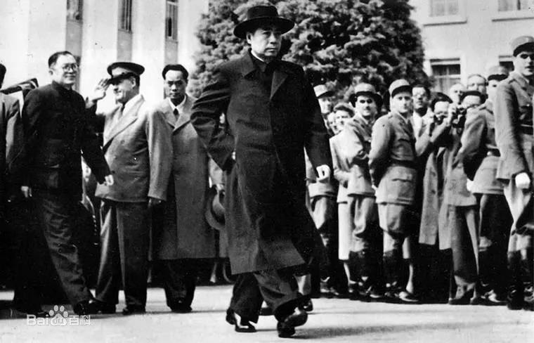

##正文

 
一

一百多年前，在第一次鸦片战争过程中，上百万军队的大清，被几千英国军队放风筝式的吊打，英军以仅阵亡69人的代价，就干掉了两万多的八旗精锐。

当时，大清也有火枪火炮，但是被打出如此惨的交换比，和签订不平等条约的背后，有一个重要的因素，就是中英两国的情报水平天差地别。

当时，林则徐等人获取英军动向，几乎只能靠外籍商人口口相传的消息，和如今股民看着不知道哪来的朋友圈截图那样，既没有真实性也没有时效性，几乎就是闭眼打仗和决策。

而英军就不一样了，一方面，英军以及东印度公司通过截获《京报》和《邸报》，就把清政府的动态摸得一清二楚。

《京报》类似于公开发行的《人民日报》，《邸报》类似于仅限领导干部看的《新华社内参》，虽然这些报纸都被限定不许外国人获得，但是有钱能使鬼推磨，英国人很轻易就拿到了清政府所有重要的公开信息。

而另一方面，英军除了公开信息之外，还能获得大量隐秘的情报来源。

当时，各地的督抚大员们，在北京都有“驻京办”，该部门除了平时走通关系之外，还肩负一个重要的使命，就是收买军机处和“有关部门”，把大量未公开的奏折和旨意，秘密的誊录出来，为各自的政治生涯抢占先机。

而这条大清朝的决策机制的通道，自然没有被早就想打开中国市场的英国人忽略。他们用现金以及情报交换，跟这些官员身边的师爷混得沆瀣一气，轻松就拿到了大清皇帝与高级官员之间机密的信件往来。

这样一来，坐拥百万大军的清廷就像脱光了摆在英军面前，战争还没开打，所有的战略意图以及兵力部署都被英军轻易的获得。

英军利用自身的机动性优势，自然就可以完美的避过所有清军布好的预设阵地，痛击那些没有防备的薄弱环节，将清军不断调动使其疲于应对，最终以极低的代价获得全胜。

 
二

1960年，英国陆军元帅蒙哥马利在访问中国时，盛赞毛泽东的辽沈、淮海、平津三大战役，可以与世界历史上任何伟大的战役相媲美，而没想到毛泽东却说：“四渡赤水”才是我的得意之笔。

当年，蒋介石调集了湘军、川军、滇军和中央军约40万兵力进行围追堵截我红军，由于双方在兵力装备上对比悬殊，红军就像长坂坡上的刘备那样，到了危急存亡之秋。

可是，刚刚执掌着起红军领导权的毛泽东，却如有神助的一般，把老对手蒋介石的部队，像巴甫洛夫训练出来的狗那样随意调动，最终通过四渡赤水般的神奇操作，跳出了老蒋40万大军的包围圈。

毛泽东为啥那么牛逼呢？

其实，这也不是他一个人的功劳，早在1929年，周恩来在上海秘密组建无线电人员培训班，后来第三次反围剿大胜，获取了大量的无线电装备，这样学员们被集中起来，专门负责监听敌台。

而就在反围剿失败，四渡赤水之际，咱们成功破译了老蒋那边的无线电密码本，所以，当时国军的相互联络和指令，以及国民党军各部的准确位置，统统在毛泽东这里成为了明牌。

因此，毛泽东和周恩来这对老搭档得以利用情报优势，不断的用假动作来忽悠老蒋。

而老蒋这个著名的炒股老韭菜，自然也被吓得一惊一乍，昏招不断频频割肉，让毛泽东轻松割了几波韭菜之后，获得了补给和装备得以轻松上路。

最终，我3万红军在40万国军的包围下，凭借着周恩来的情报和毛泽东的谋略，最终得以插翅升天，为革命胜利保留下了最宝贵的种子。

 
三

其实，回顾中国历史上著名以少胜多的大战役，几乎靠的就是情报工作。

譬如官渡之战，是曹操从许攸那里知道了袁绍粮草库的位置，而赤壁之战，是周瑜通过黄盖、庞统等人，成功的欺骗了曹操。

情报工作的重点，就是一方面收集获取对方的关键情报，以此来判断对方的重大行动，而另一方面通过释放假信息，诱导对方做出错误的抉择。

就像最近几天，漫天遍野的假消息泛滥，目的就是逼着咱们像当年的老蒋那样不断犯错不断割肉，处处设防疲于奔命，最终实力不济后，像清廷那样签订不平等条约。

而就像俗话说，独对国运的人，何曾被亏欠过？

那些选择不信假消息，并对公开信息进行统计和调查分析后，跟着我一起“为国护盘”的读者，嗯，相信今天都在资本市场获取不菲的回报。

 
四

战争中，最重要的是情报，而情报中最重要的是统计和调查。

就像当年老蒋下属的情报机构，无论是中统（国民党中央执行委员会调查统计局）还是军统（国民政府军事委员会调查统计局），从创立之初，本质搞的都是“统计调查”，进行数据的研究和分析。甚至我们新中国建立之初的情报机构，也叫做中央调查部。

电视中那种用特工去搞暗杀都是扯淡的，一个正常国家绝大部分的情报，就像当年鸦片战争之前大英对大清那样，靠的就是对公开与非公开的信息进行搜集和处理。

只不过，后来随着国民党逐渐的帮会化，情报机关也迅速堕落，“007式”的行动部门变成了主要力量。反之，我党则能潜下心来进行统计和调查，把最优秀的人才集中起来，获得第一手的情报。

最终，使得占据了情报优势的我党，逐步在战场上开始积累优势，并最终将优势确定为胜势，成立了新中国。

同样，进入和平时代，一个强大的情报分析的助力，也能够让一个国家在国际上游刃有余。

就像俄罗斯的GDP都不如广东省了，但是凭借着强大的情报机构，“克格勃头子”普京依然能够在全球叱咤风云，叙利亚内战、吞并克里米亚、美国大选、土耳其叛乱、委内瑞拉内乱、伊核六方等一系列问题上都敢于火中取栗。

同样，我们的周总理能成为上世纪最全球伟大的外交家之一，靠的也是从他当年在特科以及无线电人员培训班开始累积的情报人员，所源源不断提供的情报，才能在国际舞台上纵横捭阖。

就像1954年在日内瓦，周总理舌战“十六国”，面对美国人的不断施压，仍然获取了中南半岛话语权并将英美分化的背后，靠的不是谁的嗓门大，也不是谁的朋友多。而是靠着无数的情报人员将会与“十六国”的情报和调查分析，源源不断的提供给了台前的决策者。

而知晓了各方的诉求和底牌的周总理，像他的老搭档当年四渡赤水一样，从容之间就打出精彩绝伦的牌局，让在西方列强的包夹中的新中国，在日内瓦挺起腰杆并绽放出耀眼的光芒。

 

而日内瓦会议的65年之后，今夜，相信我们也将看到，另一位闪亮的中国之星即将冉冉升起。

##留言区
 无留言