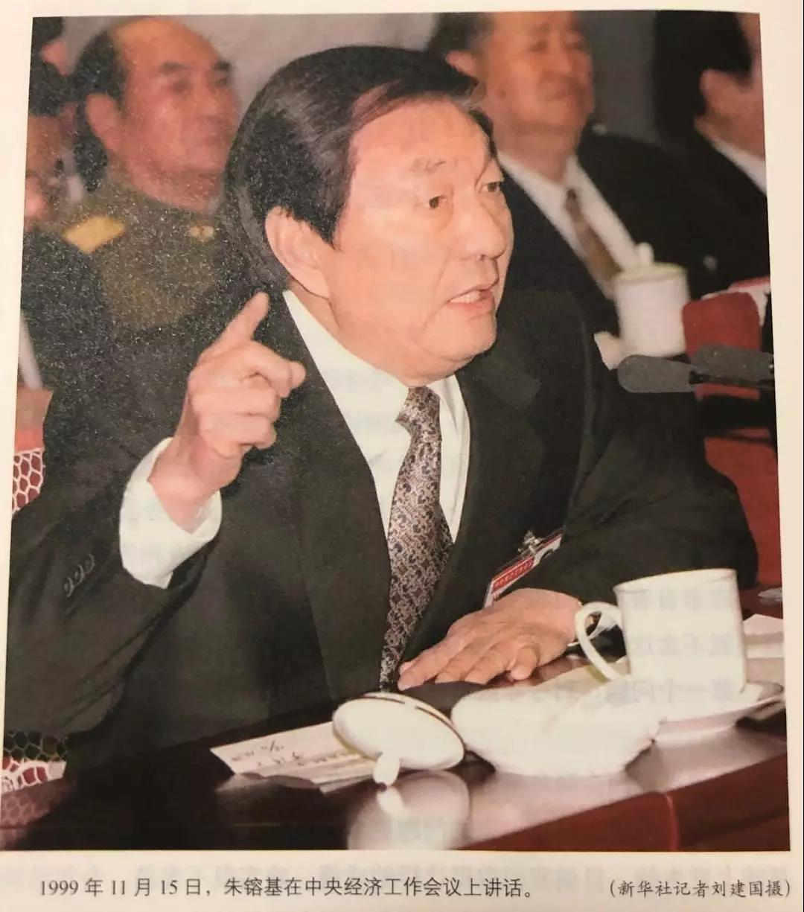
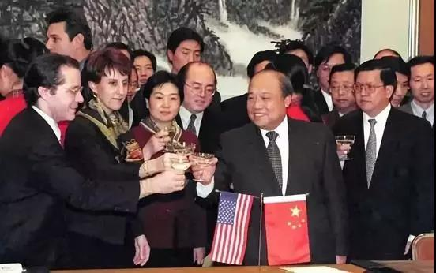
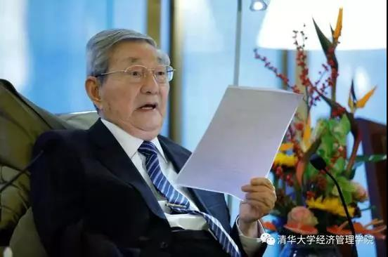

##正文

 
一

1999年4月，应美国总统克林顿邀请，访美并进行世贸谈判的国务院总理朱镕基，在白宫南草坪上发表了一场热情洋溢的演讲，并喊出了“I love American people．”

由于对双方已经敲定文本的信心，在晚宴上朱总理甚至向美国的老朋友们表示：“我们在有些可以达成协议的方面已经达成了协议，譬如说，在中国加入世贸组织方面，我们将发表一个联合声明”。

不过，当时的美国，事情正在悄然发生变化。

随着参议院否决了莱温斯基“拉链门”引发的的总统弹劾案，一门心思要赢取下届大选的共和党，开始在中美经贸领域做文章，试图利用对华谈判的“不强硬”，来攻击克林顿和民主党。

因此，在原本平衡的两派中，倾向于尽快签署协议的克林顿，突然大变脸，为了获取更多的政治筹码，玩起了“极限施压”的手段。

一方面美方代表团应共和党代表提出了大量的新要求，另一方面又将这些要求通过白宫官网对外释放，称之为中方之前的承诺。

一时之间，中方国内舆情迅速被引爆，大量的反对签署协议之声遍布朝野，资本市场也认为中美之间的谈判可能破裂，上证指数也迎来了数日的长阴。

此时的朱总理并没有退却，而是顶着各界的巨大压力，签署了中美双边协议中最重要的《中美农业合作协议》，将美国的农场主们拉上了我们的战车。

并在最后时刻通过艰苦谈判，重新修改并发布了《中美联合声明》，双方约定将继续推进被外界视为濒临破裂的入世谈判。

 
二

下一轮的谈判，地点设定为北京。

在克林顿主动给一位长者打了一通电话之后，一个得到充分授权的代表团来到了寒风凛冽的四九城。

1999年11月13日上午10时30分，中南海紫光阁，朱总理在这里会见了美国贸易谈判总代表巴尔舍夫斯基与总统经济顾问斯珀林率领的世贸谈判代表团。

这不仅仅是一场经贸谈判，更是一场意志力的比拼。

就在代表团抵达中国的十天前，美国众议院通过了所谓《加强台湾安全法案》，试图给中国继续“极限施压”。

甚至到了谈判关键时刻的14日，双方都展开了激烈的“极限施压”。

美方代表巴尔舍夫斯基表示，团队将在15日8点45离开谈判地点，去赶10点飞回美国的飞机。

而中方也向美方表示，15日上午，中国将召开每年年底最重要的中央财经工作会议，所有能拍板的重要官员都将齐聚怀仁堂。

 

于是，在谈判最后一天的14日，成为了双方意志力的决战场，巴尔舍夫斯基要单独求见朱镕基，而朱镕基只安排外经贸部的石广生部长对其回复。

朱镕基避而不见的原因，是因为对方作为职业的谈判大师，总在附和美国国内的对华鹰派进行“极限施压”以榨取利益，而此次通行的总统经济顾问斯珀林，则是对美国总统克林顿直接负责，要满足克林顿的利益。

对着谈判进入最后时刻，美方谈判代表巴尔舍夫斯基在10点钟突然消失了，直到下午4点钟才返回谈判桌上，利用时间来进一步施压。

甚至在石广生与巴尔舍夫斯谈了半个小时之后，两位谈判代表便打着跟领导汇报的旗号，各自“消失”来相互施压。

毕竟涉及到国家利益，在谈判的最后时刻，双方都在等着对方给自己先主动认怂。

当然，在相互等待中，谁都没有闲着，石广生回去后，带队逐字逐句校对公告的新闻统稿，而美方代表们则在通宵核对协议文本。

最终，在这场相互极限施压的比拼之下，代表克林顿的斯珀林在龙永图之前先撑不住了，在11点半北京寒风凛冽的夜里，给了正在空军一号上陪同克林顿出访欧洲的国务卿奥尔布赖特拨了两通电话。

通完电话，在空军一号上进行了一场讨论之后，15日的凌晨3点半，美国国务卿奥尔布赖特终于用卫星电话拨通了中国总理朱镕基的红机.......

为此一夜未睡的朱总理，终于等到了奥尔布赖特的电话后，取消了去怀仁堂主持中央经济工作会议，一早带着副总理钱其琛和国务委员吴仪去到外经贸部，参与到了最后的谈判中。

在谈判仅剩下的最后几个小时，面对中美双方最后几个都无法退让的条款，朱镕基极其远见地定下主基调，双方回国不方便交代的内容，全部以不公开的书面记录形式定稿。

随即，在国务卿奥尔布赖特施加的压力之下，解决了里子与面子的巴尔舍夫斯与斯珀林，孤男寡女的在二楼签字室旁边的一个女厕所，向正在空军一号上面洗澡的总统拨通了电话........

老爷们斯珀林站在女厕所里对克林顿兴奋的说：报告总统，世界最艰难和伟大的谈判结束了！

 

而此时，已返回怀仁堂，继续主持中央经济工作会议的朱镕基，向台下我党的高级领导们解释，自己上午的开小差，是去“强迫”美方谈判代表签字，并在会场上正式宣布，中美世贸谈判成功结束！

谈判中，极限施压，永远都是相互的，只有在能够承受足够的压力之下，才能够为国家争取到足够的利益。

正是这位已经七十多岁、愿为改革粉身碎骨老人家，面对美国上下的极限施压和国内的激烈反对，愣是靠着坚定的意志力不眠不休，在不断的挫折打击甚至不理解之下，完成了历史性的世贸谈判，将中国带入了高速发展的快车道。

 

而随着进入世贸组织，中国从一个数千万人下岗难寻就业的国家，没用十年的时间就超越日本为全球第二大经济体，实现了国运的惊天大逆转，而我辈中华儿女也凭此赶上了历史的进程。

历史进程的背后，回想那满头的白发和疲倦的面容，是多少日夜的唇枪舌战和不眠不休，在那曾经英气勃发的脸上刻下无数岁月的痕迹。

没什么岁月静好，只因有人在“极限施压”之下，替我们负重前行。

本文史料主要取自《朱镕基讲话实录》，长按二维码可跳转

##留言区
 

