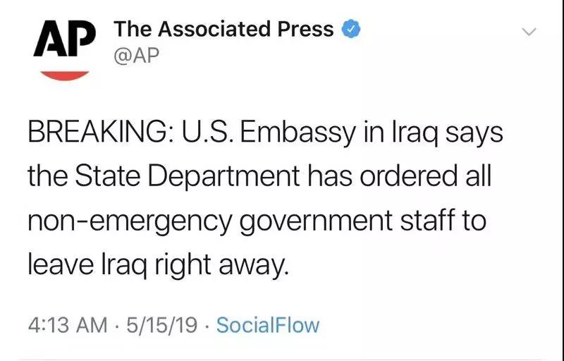
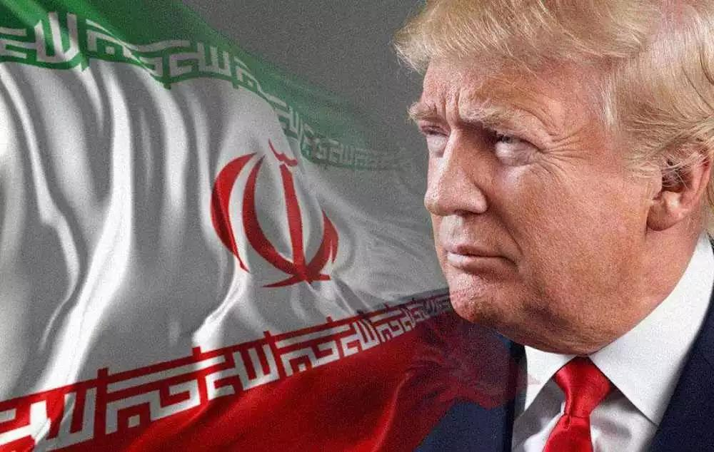
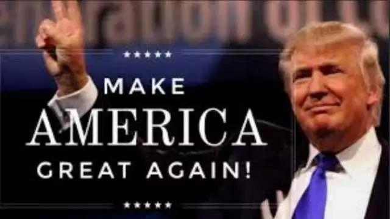
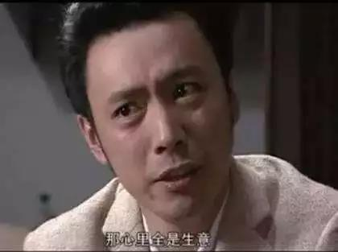

##正文

随着美国和伊朗紧张关系的升级，今天下午4时许，美联社发布消息，美国要求驻伊拉克大使馆所有非紧急政府人员立即撤离。

 

又是大使馆，又是紧急撤离........不由得让人想起了40年前的那场“逃离德黑兰”。

 

1979年11月，在伊朗宗教领袖霍梅尼的支持下，一群学生冲击了位于德黑兰的美国大使馆，扣押了66名外交人员。

旋即，美国宣布制裁伊朗的经济并封锁伊朗的石油，而伊朗也宣布退出石油美元，双方不断相互加强制裁，将曾经蜜月的盟友迅速变成了剑拔弩张的敌人。

因此，在如今美伊紧张关系不断升级的情况下，美国在一个毗邻伊朗的什叶派国家撤出大使馆，不由得令人很多人担心伊核问题乃至油价的走向。

 

说起来，很多人都把特朗普退出伊核协议，是特朗普中东激进战略的一环。其实大家还真想多了，喜欢追求功绩的特朗普，并非不想在自己任期内达成一个历史性的伊核协议。

就像继去年5月特朗普宣布退出《伊核协议》后，美国政府制裁不断升级，谋划动武、构建“阿拉伯版北约”甚至威逼各国停止从伊朗进口石油的同时。特朗普也不断通过各种形式表示愿意同伊朗会面，甚至表示会面可以“不设先决条件”。

所以呢，如果对比特朗普在全球其他领域的那些动作，就会发现，这些特朗普都是利用“疯狗咬人”，进行“极限施压”，为自身获取最大利益的惯用手段。

而且考虑到40年前，那场长达444天的人质危机，直接导致了当时人气爆棚的卡特总统连任失败。特朗普自然也不愿意在连任形式大好的情况下，给自己挖坑下套。

 

说起来，很多人并不理解特朗普为什么认为伊核协议是一个非常差的协议。

其实很简单，随着伊核六方签订协议之后，制裁逐步解除，伊朗的石油出口激增。但是在这个协议的监督之下，伊朗巨额的石油销售款无法通过银行转账返回国内。

因此，伊朗只能跟几个伊朗石油的进口大户，退回到传统以物易物的交易，譬如在欧洲购买空客的飞机，从俄罗斯购买军火，以及从中国进口大量的工业制成品。

这样的交易之下，伊核六方中，英法德俄中五方都在协议中获得了巨大的利益，尤其是欧洲的那几个“流氓”，卖的那可都是高利润的产品。

但是，并不从伊朗买入石油的美国，自然而然就无法在“以货易货”中得到利益，因此对于双边贸易极为敏感的特朗普，自然就要把民主党时期签订的协议推到重来，进行利益的重新洗牌。

故而伊核问题上，“利益受损”的特朗普咄咄逼人，但是英法德俄中乃至美国的民主党，这些既得利益者都在极为克制的维护者这份协议。

毕竟，把伊朗按在谈判桌上签订协议的几大列强，嘴里都是主义，心里全都是生意........

 

所以，整个的伊核问题就搞成了一场大国角力的战场。

不过，虽然想重新签订协议的特朗普本人并不想把事情闹大，但是并不代表他的手下，不想搞个大新闻。

这就像40年前，卡特的国家安全顾问布热津斯基为首的强硬派，一直坚持制裁伊朗并动用武力那样，目前特朗普的国家安全顾问博尔顿也是坚决的对伊强硬派。

因此，就在特朗普试图利用博尔顿等人为自己谋求利益的同时，博尔顿们也在利用特朗普的算计，暗中搞小动作，来推动自他们的控制世界岛，重返中东的计划。

这就像以朝核谈判为代表，特朗普近年来国际上一系列的动作，到最后一步的时候都容易擦枪走火那样，打开了伊核问题这个潘多拉魔盒的特朗普，恐怕也没有那么容易合上它。

尤其是伊朗，这是中东国家里面除了以色列之外，唯一实现了政治势力相互制衡的国家，没有哪一派能够做到政治上的一家独大。

因此，极限施压的特朗普，等来的并不是那个历史性的领导人会面，反而是让在施压之下，美伊的对抗不断升级。

毕竟，在极限施压之下，谁也不愿意挂着“卖国”的名义去谈判，给竞争对手送弹药。

所以，再来看看伊朗国内。

伊朗政坛有两大派系，分别是改革派和保守派，其中保守派中又分为温和派与激进派。目前伊朗总统鲁哈尼，作为温和的保守派，在奥巴马时期签订了伊核协议。

随后在伊朗改革派的支持下，鲁哈尼在2017年击败了其他三个热门强硬保守派人选，其中包括被伊朗宗教领袖哈梅内伊“钦定”的候选人。

因此，回顾伊朗政局，总统鲁哈尼并非哈梅内伊最信赖的政府领导，但是随着伊核协议签订后的伊朗对外开放，改革派的势力不断扩大，甚至打破了保守派垄断议会的格局。这使得哈梅内伊也不得不支持鲁哈尼，以弥合伊朗国内的分裂情绪，并保持政局的稳定。

这样看来呢，奥巴马及其背后的民主党，在伊核问题上也是一种“温水煮青蛙”，虽然美国没有获得过多的经济利益，但是却在慢慢的改变伊朗政局，推动伊朗国内的改革派不断作大。

可是在特朗普上台后，他在伊核问题上施加的压力，使得原本逐步得势的改革派的改革进程突然停止，平衡的伊朗国内政局也在混乱中开启新一轮洗牌。

其实，这就和40年前的“逃离德黑兰”很像，时任伊朗总理谴责冲击美国大使馆的行为；前总理更是发表声明，愿就事件解决做出让步，与美国进行协商。

甚至伊朗国内的各股势力也纷纷表态，呼吁民众冷静下来，放弃“不要西方，不要东方，只要伊斯兰”的政策，继续保持与美国的良好关系。

但是，随着布热津斯基等美国强硬派势力占据了上峰，选择进行武力救援，直接导致了美伊关系破裂，使得在伊朗，温和的亲美派占据下风，强硬的宗教领袖们完全掌控了伊朗的最高权力........

历史不会简单的重复，但总是踩着相似的韵脚。

如今原本在美国的支持下，通过渐进式获取伊朗权力的改革派与温和派面临了大麻烦，他们随着特朗普政府制裁的加剧，引发的民众反美热潮而纷纷失势，而伊朗的激进保守派，却在民族主义的刺激之下再一次抬头。

因此，某种程度上说，倾向于激进保守派的伊朗宗教领袖哈梅内伊，将乐意于看到特朗普的极限施压，甚至在深知特朗普为了竞选连任而不会主动挑起战争的情况下，去默许小冲突的发生，让便于其加强伊朗局势的控制。

故而可以预见的是，**未来伊朗的局势，由于伊朗政局的特殊性，以及美国白宫内的勾心斗角，将不同于全球其他特朗普同期进攻的领域，未来会陷入“大乱很难，小乱不断”的局面。**

而中东乃至全球的政治家们，也会利用这个混乱的阶梯，或去追求国家民族的最高利益，或去实现他们个人的远大抱负........

 

近期关联文章：

制裁伊朗背后，特朗普的世纪交易

逆转1999！朱镕基的“极限施压”

##留言区
 

