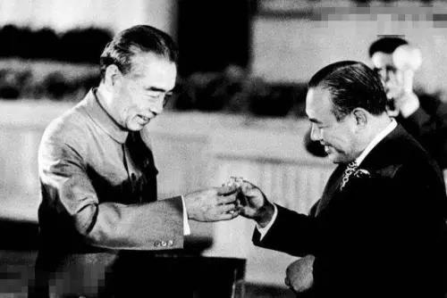
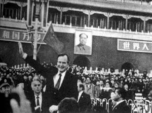

##正文

 
一

1972年9月25日，一支庞大的代表团抵达北京，不同于半年前尼克松访华时冷清的欢迎场面，在接机的周总理身后，站满了穿着鲜艳衣服的学生与欢迎群众。

能够受此隆重欢迎的，是两个月前刚刚出任日本首相的田中角荣。

这位新中国成立以来首次访华的日本首相，他此次应邀前来，目的是签署《中日联合声明》，将百年宿敌的中日关系拉入正轨。

中方为示尊重，由周总理亲自将田中角荣送到钓鱼台国宾馆最好的18号楼里，而日方作为回应，田中首相硬是抢在工作人员前面，主动过去帮周总理脱风衣。

虽然中日双方领导人对于达成和平协议有着共同的热切期望，但是中日之间有大量的历史遗留问题难以短时间内解决，如台湾问题、钓鱼岛问题、战争赔偿等都是横在双方面前难以逾越的鸿沟，这也使得谈判争论极为激烈，田中角荣一度对达成最终协议也都没底。

毕竟，这位出访前为了释放焦虑整整打了7个小时的高尔夫首相，是不顾当时国内极右势力的反对和阻挠来访的，甚至他为了防止意外，在出访前临时改成直升飞机抵达机场。因此，一旦达成一个对日方不体面的条约，必将重挫田中的支持度，甚至毁灭他的政治生涯。

而同样，自甲午战争以来，日本对中国造成了罄竹难书的灾难，中国人民对日本的仇恨是刻在骨子里的，民众们无法接受站起来的新中国竟然会跟宿敌签署“不平等条约”。

因此，双方在谈判后期陷入到各自在里子面子的问题上，均无法让步，谈并进行了激烈的争吵。甚至在中田会见毛泽东的时候，毛主席都在开玩笑，“你们吵架吵完了?”“不打不成交嘛!”“总要吵一些，天下没有不吵的。吵出结果来就不吵了嘛!”........

但是，在周总理求同存异的大智慧下，所有双方无法让步以及难以向各国民众交代的条款，均选择搁置争议，先不写入联合声明之中。

不过，到最后一场谈判，联合声明的文字已经敲定，日方对于中方的口头承诺持有怀疑，因此迟迟无法最后签字。

此时，周总理当场写下六个字“言必信，行必果”交给田中角荣，而田中角荣看后，也用汉字写下了“信为万事之本”交给周总理。

最终，一份靠着双方个人信用背书的《中日联合声明》就此诞生，中日之间的友谊，也在双方领导人的友谊中得以升华。

 

说个题外的段子，两国首脑喝茅台酒的故事在日本传开后，茅台酒在日本市场上的售价一下子涨了三四倍。

 
二

1978年10月22日，一架尾翼上有红五角星的中国专机在东京羽田机场徐徐降落。

舷梯停靠后，早已等候在机场的日本外相园突然改变原定在舷梯下迎接来宾的计划，一路小跑奔入了机舱迎接。首相福田赳夫更是在国宾馆举行盛大仪式，欢迎中方到访的贵客。

而享受这一破格欢迎的贵宾，是中国的邓小平。他此行的目的，是互换中日和平友好条约批准书仪式。

此时，签署《中日联合声明》的前首相田中角荣正处于自己的政治低谷，因洛克希德案在1976年7月被东京地方检察厅正式逮捕，他本人也于先前辞去首相和自民党总裁职务。

而被天皇和首相轮番款待的小平同志却坚持与日方表示，此次访日期间一定要见田中角荣，虽然他深处政治逆境，但不能影响他对中日邦交正常化的历史贡献，中方也不会忘记这位老朋友。

虽然对要求不满，但为了表示对中方的尊重，日方还是满足了这个要求，甚至在小平访问田中私邸时，日方出动了大约8000名警察执勤，形成了一道5米一岗的安全防线。

当时，在私宅中等候小平的田中，从清晨起就不断在门口出出进进，心神不定，生怕错过了在大门口迎接邓小平的机会。

而日本国会里的40多名田中派议员更是一大早赶到田中家里。当邓小平和田中在齐呼“欢迎”的“田中军团”面前走过时，其情景仿佛阅兵式，这也给当时正处于低潮的田中派巨大的鼓励和支持。

甚至在1992年，此时田中角荣因患中风，行走不便，说话也很困难。但访日的江主席依然决定亲自前往他的住所看望，并赠送了国宝级的画和印章。

此时，由于中风不能说话坐在轮椅上，从毛泽东时代跟中国打交道的田中，看到早已换了几代人的老朋友，依然如故的支持自己，不由激动得老泪横流。

可以说，不同于其他国家人走茶凉式的外交，中国对于老朋友们的友谊，都是地久天长的。

 
三

1976年2月21日，一家中国政府派往美国的专机，返回北京机场后，受到了北京市民的热烈欢迎。

可是这位从停机坪走出来的，却是一介平民。

他就是美国前总统尼克松。

此时的尼克松，并非五年前访华破冰时的那位美国总统，由于水门事件爆发，陪审团把其定为“水门事件”的同谋者，而面临被国会弹劾的威胁，不得已于1974年8月辞职，由副总统福特继任总统。

可以说，因丑闻被迫辞职的尼克松，突然从全世界最有权力的人，沦为了一介平民，受史上最严重的丑闻影响，他本应从此淡出美国的权力中心而被人遗忘。

但是，中国的老朋友们没有忘记尼克松，在共和党已经将其抛弃，周边人都已众叛亲离之际，周恩来和毛泽东先后致电，邀请尼克松访华，将其重新拉回政治圈，挽救了他的政治生命。

而且，在访华过程中，中方依然是按照总统待遇对待这位老朋友，并为他举行了国宴，一切都和4年前一模一样：一样的布置，一样的尊敬，一样的礼仪，就连餐桌上的十道菜也和当年一致。

甚至当时周总理刚刚去世，毛主席身体也已经十分不佳，但仍将会谈进行了1小时40分钟，只比刚刚结束访华的总统福特少十分钟。

可以说，在民主党弹劾他，共和党抛弃他，北约盟友对其唯恐避之不及的时候，中国却向这位老朋友伸出了橄榄枝，让他成为中美关系的特使往返于中美之间。

甚至在80年代末中方领导层换届时，我们还邀请尼克松访华，逐一会见我方的第二代和第三代领导集体，让这位早已远离政治中心的前总统，依然能够在中国享受总统级的待遇，并能够籍此继续活跃在美国政坛。

 

说起来，无论是中日破冰的田中角荣，还是中美破冰的尼克松，从这几个故事当中，我们能从冰冷冷的国际政治中，看到人性的温情。

不用于西方政府换届都会对之前的外交战略进行调整，几千年传统文化的中国外交总是能保持着一个长远的态度，尤其是对于那些交手过，但最终达成协议的老朋友，中国对他们的承诺有效期都是一辈子，并不会因为他们被弹劾或者下台甚至死亡而改变。

而正是这种长期而有效的承诺与坚持，使得在近代外交中，中国的政治家尽管拿着一副不好的牌，却凭借着技巧取得了巨大的成绩，将一个个的对手变成了我们的朋友。

这是因为西方在打拳击赛的时候，我们玩的是接力赛。

##留言区
 无留言