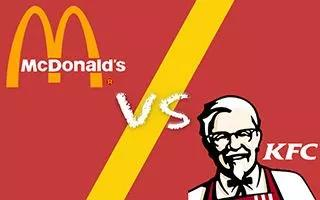

##正文

今天文章的主旨是分析台湾地区领导人的博弈，不过在此之前，先讲一个商业逻辑。

1987年11月12日，那一天北京呼啸的北风中，飘舞着漫天的雪花，可是寒风与飘雪并不能阻止前门的一家三层楼店铺门前排起了一条长龙，由于等待的人是在太多，餐厅不得不求助公安来维持秩序。

那一天，肯德基在中国开了他的第一家餐厅。

在那个大陆GDP仅是台湾两倍的时代，普通中国市民的月收入不过30-40元的时候，肯德基按照一天一万元缴纳的租金，最初被视为中国赚取外汇的重要手段。

不过，超乎所有人预料的是，肯德基前门店开张以后，房租成本不足整个店铺营业额的1%，这个签署了十年合约的炸鸡店，成为了肯德基的超级印钞机。

同样，1990年10月8日，深圳市罗湖区东门商业步行街上，麦当劳的第一家门店营业了，一家炸鸡店4000万的投资规模，相当于当年罗湖财政收入的1/4。

当然，跟肯德基类似，这家麦当劳开业后也突然爆满，公司不得不临时从香港抽调500多人的团队来临时应急，可想而知，那4000万投资对于麦当劳来说自然也是“洒洒水啦”。

而随着肯德基和麦当劳的先后入华，我们看到在市中心，每一家麦当劳建成后，旁边没多久就会出现一家肯德基，同样，每一家肯德基的后面也会有一家麦当劳，两者就像一对奔波霸和霸波奔一样形影不离。

而两家店形影不离的背后，是博弈论在作祟。

我们假设一条的商业街上，从左至右为一公里，那么如果炸鸡行业被一家垄断的话，那么在这条街上开两家，就应该是在商业街中心左右各250米的位置上各开一家店，让每位顾客以最便捷的方式购买炸鸡。

但是，一旦这个垄断的行业被分成两家同质化的公司之后，由于顾客都喜欢就近购买，因此两家分列左右的炸鸡店，都愿意向中间靠拢，以抢占对方的客流。

最终，在一连串的博弈之下，双方往往都会把店铺开在这条商业街的正中央，形成了纳什均衡。

 

上面是理论，而实际的生活中，任何一个城市或者商街，人流量都不是线性的，而是在中心城区以及商业中心汇聚，因此在“正态分布”之下，抢占中心位置的效果会有进一步的加强。

由于炸鸡店的巨大利润，使得麦当劳和肯德基不仅拥有强大的顾问团队，能够精准计算出这条商业街人流的最中心位置，而且也能支付的出最高的租金。

因此，两者在实践中，不必向博弈中那样一点点向中间挪，在调研得出结论之后，各自把商街上最中心的位置高价买下，大家一起躺着赚钱即可。

而在经济学当中，这个现象称之为hotelling's law，如果有两个实力强劲的竞争对手，而且有足够高额的利润，那么两者的选址会极其相近，譬如，有阿迪达斯的地方一定会有耐克，香奈儿旁边也一定会有迪奥。

而这个经济模型扩展一下，就可以讲政治了。

就像一条从左至右一公里的商街，中间的人流量最高，同样，一个发达国家的经济也是一个纺锤体的结构，“不左不右”的中产阶级占据了大多数。

所以，如果这个国家或者地区，是由两个主要政党竞争的话，那么这俩实力相当的政党，和麦当劳肯德基类似，为了获取巨额的利润，便会迎合大部分中间群体的需求，慢慢观点也会趋于一致。

因此，在受到移民冲击之前，全球两党制的主要发达国家当中，美国的政权一直被民主党建制派和共和党建制派两个观点相似的势力所把持。

譬如，布什家族和克林顿家族好的穿一条裤子，老布什、克林顿、小布什、希拉里四代人轮流坐庄；同样，早早实现工业化的英国保守党和工党国内政策的差异也非常小，英国人一度把保守党财政大臣巴茨和工党财政大臣克尔的政策，合写成巴茨克尔主义。

但是，当全球化和大规模的移民冲击开始之后，这个旧的纳什平衡就不再平衡了。

一方面，全球化带来了贫富差异急速扩大，使得西方发达国家的中产阶级出现了阶级下滑，使得中产阶级的中位数向“右”靠拢。

通俗点说，就是很多人突然不能天天吃得起随着平均收入上涨，价格也不断上涨的“麦当劳肯德基”了。

另一方面，随着移民大量的涌入，文化以及生活习惯差异带来的冲突，使得那些中位数之下“右”的群体，很容易被舆论引导将愤怒发泄在移民身上。

通俗点说，如果这个时候，突然出现一个华莱士炸鸡，虽然地角都略逊一筹，但是价格却便宜很多。那么很多原来吃麦当劳肯德基，但是被全球化和移民冲击的中产群人，就会“岂因地角避趋之”，怒而转向支持华莱士，而且跑的比谁都快。

 

所以呢，从科学的角度，这就解释了在08年次贷危机之后，利用全球化和人口迁移带来的巨大财富，成功拯救了全世界的美国民主党，为什么会被他所拯救了的人民所抛弃。

毕竟，法德等多党制的国家还好，顶多是在全球化和移民涌入的情况下，极右翼政党突然崛起，然后中左和中右的建制派们联起手来一起打压也就完事儿了。

但是，纳什均衡一旦右转，英国和美国这种两党制的国家突然就傻眼了。

就像一条街上只有一家麦当劳和肯德基的情况下，人流开始向右移动的话，任何一家店向右搬迁就会获得更多的人流。

同理，两党之中，任何一个党内竞选者右转，就会很容易获得党内更多的支持而胜出，而这个右转的政客，也会带动整个政党右转，使得这个政党获得更多的选票。

而这几年来全球化和移民冲击，使得贫富差距拉大，中位数右转，也就使得英美这两个两党制的国家，在一系列的博弈之下，出现了建墙的特朗普和硬脱欧的鲍里斯。

好了，写了那么长的科普，接下来就要讲一讲最近热议的郭台铭和韩国瑜，这两位国民党的竞选者的逻辑。

随着两岸关系在蔡英文时代的恶化等原因，台湾经济尤其是农产品和观光陷入停滞，大量原本的中位数人口开始右转，因此，草根形象出身的韩国瑜在右翼选民的支持异军突起。

但是，作为台湾最大的企业家，庞大的家业以及长久以来的人设，决定了郭台铭只可能走建制派路线。

由于我国台湾地区是两党制，因此就会出现麦当劳和肯德基在选址过程中不断的中间化那样，**郭台铭在与蔡英文的竞选过程中，会越来越“蔡英文化”，喊出大量与民进党一致的口号，以争夺中间派的选民。**

因此，如果国民党那些那些操盘的大佬，准备获取一场全面的胜利（地区最高领导人+地区议会），那么郭台铭+韩国瑜的组合就是最佳选择。

 

郭台铭像麦当劳，与蔡英文的肯德基在人流汇聚区争取中间派的选民；而韩国瑜则像麦当劳这些年新开的甜品店，将右翼的基本盘紧紧的锁死，两者搭档，可以获得一场史诗级的胜利。

而同样，利用麦当劳与肯德基往一起建店铺的经济学逻辑也能知晓，假如未来韩国瑜也像郭台铭一样，开始向蔡英文的中间路线倾斜，那么就意味着韩国瑜将独立参选硬抗郭台铭，而内战内行的国民党则有可能就要在形势一片大好的局面下翻车。

从时间来看，相信用不了多久，这场台湾地区的权力游戏就将进入高潮。

嗯，让我们一起用科学的眼光吃瓜看大戏吧！

##留言区
 

