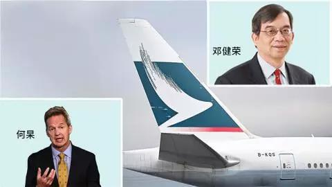

##正文

 
一

1845年3月7日，就在南京条约签订的两年多后，一艘载满的商船驶向了留尼汪岛。

船上载运的并不是货物，是200多名中国苦力。

这艘船，也是从中国开出的第一艘苦力船。

随着南京条约让中国沦为了半殖民地，刚刚签订了《制止非洲奴隶贸易条约》大英帝国便把目光投向了东方，奴隶贩子们来到中国口岸以“招募”为名，大肆诱骗和掳掠。

那些以为拿到了工作的华人们，没想到出国之后便被卖为奴隶，随着大量中国苦力在英国人的苦力船向全球输出，一个中文音译的英文单词“coolie”也便应运而生。

但是，这个单词的背后，却是一本百年的血泪史。

苦力们一上船，便如同货物一般被全程被囚禁于船舱内，甚至有的胸前就被烙上运往目的地的标记。由于生活条件极端恶劣，死亡率接近一半，故此苦力船亦有“浮动地狱”之称。

而即使下了船，苦力们依然过着非人的生活，在奴隶般的劳作之下，古巴的苦力劳动寿命平均只有五年，死亡率达75%，1860年运往秘鲁钦查岛挖鸟粪的4000名苦力，几乎全遭惨死。

但是，这并没有阻止如火如荼的苦力贸易。

在十九世纪，黑奴解放运动的风起云涌直接冲击了庄园主们的利益，而工业化的如火如荼又使得工业资本家们更是需要大量的劳工去铺设铁路，于是在非洲无法找到足够人口的帝国主义纷纷把目光转向中国。

为了扩大中国的苦力贸易，1860年英法迫使清政府签署的《北京条约》中，第五款即“允许民人出洋承工”。

从此，鸦片贸易和苦力贸易，成为了列强们对华贸易的两大支柱，英美两国也都将香港作为据点。

随着鸦片贸易和苦力贸易带来的巨大利润，香港迅速崛起。

其中，有一家贸易公司就利用苦力贸易赚取了第一桶金，并利用其迅速在中国长江航线内进行扩张，他的名字叫做约翰·施怀雅父子公司。

由于公司做中国生意，看到中国人家喜欢在门上贴“大吉”二字，于是公司老板决定将“大吉”作为公司的中文名字。

可没想到因为笔误，“大吉”变成了“太古”。

 
二

就在第一艘苦力船开出中国的一百年后，国泰航空成立了。

在国泰成立的两年后，太古集团就入股该公司占了四成半股份，成为了公司的最大股东，国泰航空也变成了纯正的英资公司。

由于目标就是做中国生意，因此用“契丹”的英文“cathay”作为了公司之名，甚至他的常旅计划都叫做马可孛罗会，玩的都是东方神秘色彩。

1958年后，在港英政府的帮助下，国泰收购了另一家竞争对手香港航空，垄断了亚洲金融和情报中心香港的全部始发航线资源。

有着英国爸爸的支持和垄断，国泰迅速成为了全球实力最强的航空公司之一，而国泰的母公司太古，更是与怡和、会德丰、和记黄埔并称为香港的四大洋行，掌握了香港一半经济命脉。

20世纪80年代前，这四家洋行的主人都是英国人，分属于施怀雅家族、凯瑟克家族、祈德家族与马登家族。

不过，随着70年代中美破冰，香港迅速成为了神秘的中国与西方世界的贸易通道，香港股市从1971年底的341.36点，一鼓作气冲到了1973年的1774.96点。

在中国对外贸易的推动下，那些曾经被英商压制死死的华裔商人们迅速崛起，甚至在祖国支持下团结了起来，开启了一场对英资的绝地反击。

1979年，在包玉刚的帮助下，李嘉诚收购和记黄埔，1980年，在李嘉诚的帮助下，包玉刚收购了怡和的九龙仓，1985年，包玉刚在华裔财团们的支持下，购入会德丰......

随着中国的改革开放，香港的四大英资洋行中，一家撤离，两家被收购，只有施怀雅家族的太古洋行，成为了香港众多巨头之中，唯一的一家英资财阀。

 
三

当然，太古当年并非没有受到冲击，而是得益于他的手腕足够灵活。

随着80年代《中英联合声明》的签订，回归后的香港航线自然也成为了各方角力的场所。

著名的爱国商人毛纺大王曹光彪想到，为啥香港的航空权一直在外国人的手中，中国人咋就不能在香港的航空事业上有所作为呢？

于是在 1985 年初，曹光彪迅速联合包玉刚、霍英东、李嘉诚、安子介、冯秉芬、马万祺等31名港澳商界排得上数的大哥，以及中国银行、华润公司、招商局等中资机构，合资建立了港龙航空公司，试图打破了英资独家垄断的局面。

不过，当时国泰航空的两个大股东分别是古集团和汇丰银行，各持有国泰70%和30%的股权。由于强大的英资背景，国泰航空得到了港英政府的全力支持，全面打击华资的港龙。

港英政府先是以飞机型号为由撤销了港龙的申请，后又要求提供股份由英籍人士拥有控制的证明，甚至看这些都无法阻止港龙之后，又规定一条航线只能由先获发牌经营的航空公司独家经营，直接扼杀了港龙新开航线。

不过，有着张爱萍将军手书“龙腾”的曹光彪并没有轻易放弃，而是跟国泰和国泰背后的太古继续死掐。

此时，身段灵活的太古并没有选择硬碰硬，而是选择了合作共赢，1987年太古向中信出让了国泰航空12.5%的股权，作为交换，国泰入股中信控股后的港龙，以第二大股东的身份获得了港龙的实际管理权。

借此，国泰躲过了第一劫。

当然，中国的商人们，对打破香港民航业英资垄断的努力从未中止，中航香港分公司在1995年以恢复业务的名义再次进军香港。

虽然港英政府坚决反对，但是中航翻出了70多年前在香港运营的历史，证明其恢复业务有理有据，逼着马上要退出的港英政府同意给予牌照。

而没有爸爸坚定支持的太古，再一次体现了其灵活的身法，选择让国泰出让港龙36%的股份，以交换中航放弃恢复香港业务的计划。

借此，国泰躲过了第二劫。

不过随着1997年香港的回归，香港特区政府取消了航线管制，中资控股的港龙和英资控制的国泰重新开始正面竞争。

于是，太古再一次展现了其灵活的手腕，让国泰航空和国航达成了交叉持股协议，持有30%股权的国航成为了国泰的第二大股东。

借此，国泰躲过了第三劫。

2017年，过于国泰业绩持续下滑，太古不得不引入卡航成为国泰的第三大股东，而随着股权的不断稀释，太古对国泰的绝对控制也在减弱，财务入股中资也在不断寻求扩大对太古的实际控制权。

就在各方博弈的关键时刻，嗯，有人自己往枪口上撞了。

大概，这就像央视主持人说的，“no zuo no die”。

 

这些天来，太古集团和国泰航空的股价一直跌跌不休，甚至工银国际发布了一份国泰航空研究报告，下调其评级至“强烈卖出”，降目标价39%至6港元。

这不是逼着英国佬割肉么？

面对国泰历史上的第四劫，一贯身段灵活的太古集团在昨天紧急召集国泰航空董事会，会上，行政总裁何杲以及客户商务总裁卢家培被责令辞职。

 

而且，可以预见得是，在大股东太古的压力下，国泰航空的管理层势必还会进一步进行调整，中资在香港航空领域的话语权势必将进一步增强。

这不仅仅是资本的较量，更是几代中资一棒接一棒传递下来的精神与意志，要让香港的空域成为中华民族国泰民安的屏障。

而这也是为什么这一个月以来虽然纷乱不已，但我的文章都非常乐观。

因为我知道，如今的中国不再是鸦片战争时被西方肆意欺凌的东亚病夫，随着我们站起来，富起来，强起来。在混乱之中，我们会理直气壮的拿回属于我们自己的东西。

##留言区
 

