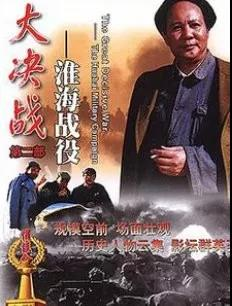
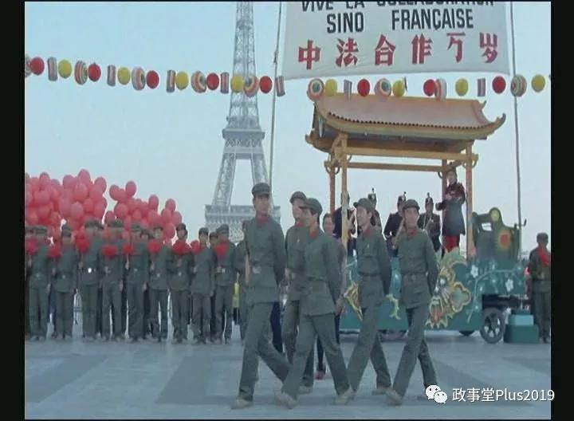
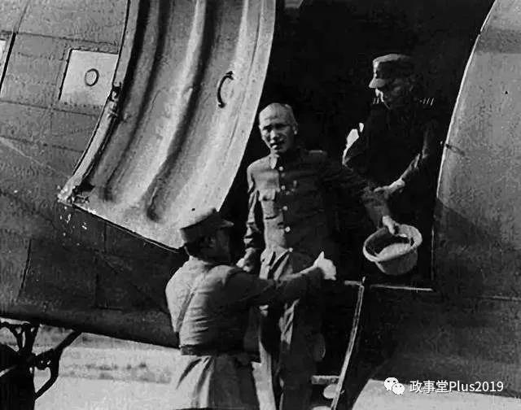

##正文

记得毛泽东同志当年有个非常经典的论断，叫做“抗日战争快不得、解放战争拖不得”。

这句话后来也成为了电影《大决战·淮海战役》中最经典的一段台词。

 

说起来，这两句话背后的逻辑其实并不复杂。

当年的抗日战争是一场防御战，拥有足够韧性的我们就是一个抻字诀，拖到我们内部准备充分了，拖到敌人外部生变，然后就会出现“攻守之势异也”的局面。

毕竟日本自1937年以来不断加大侵华规模的背后，本质还是想寻求在中国的特殊利益，要让国民政府签署一份丧权辱国的条约。所谓的征服或者毁灭并不靠谱，毕竟以中国的人口体量，日本不可能彻底征服汉地十八省。

因此只要拖得久了，到了时间点上，日本和美国民主党的罗斯福政府的矛盾必然会激化，偷袭珍珠港之类的事件必然发生，中国只要拖到日本和美国开战，那么抗日战争就已经有了七成的胜算。

反之，解放战争是一场进攻战，我们的目标是避免外部力量干涉实现祖国的统一，因此只要开战就坚决不能拖，否则日久生变，到时候各股力量都将参与其中，试图捞一笔，届时我们根本承担不起。

所以呢，就像我去年复盘过抗日战争以应对贸易谈判，今天复盘一下解放战争，这对于我们理解如何推动祖国统一，有着非常好的指导意义。

那么，解放战争为啥能避开西方的干涉，赢得这么轻松呢？

首先呢，解放战争有着非常好的天时。

一方面，1948年正好是美国大选年，杜威和杜鲁门之间为了争夺总统大位打得不可开交，由于杜鲁门的任何不合适的动作都会被杜威盯着打，因此这一年美国对外几乎处于瘫痪状态，只能维持现状。

而另一方面，随着二战的胜利，轴心国不再是自由世界的威胁，美苏之间两大集团成为了世界的主要矛盾。

在英国首相丘吉尔发表铁幕演说分裂欧洲后，美国总统杜鲁门拉着鹰派们启动了马歇尔计划，使得美苏之间对抗重心并没有在二战后解体的亚非拉殖民地，而是集中在了欧洲。

而且，非常幸运的是，就在中国解放战争的关键点上，欧洲爆发了柏林危机，苏联试图让西德“脱欧”加入到社会主义阵营，导致了西方八国集团之间的激烈对抗，各路大军于欧洲枕戈待旦。

这段时间美国人绝对不敢将注意力有任何的转移，否则浪漫的法国人分分钟去热烈欢迎苏联解放军.....

 

因此，从1948年6月苏联开始封锁西德，至1949年5月苏联宣布解除封锁，美苏之间关系缓和，西方列强们给了我们整整一年解决国内问题的窗口期。

其次，解放战争有着非常好的地利。

在半个世纪之后的海湾战争时期，美国在取得国会授权和盟友支持的情况下，把美军部署到海湾地区尚且花了半年的时间。

且不说当时美国国会那毫无效率的扯皮，就算国会一天都不浪费，同意把集结在欧洲的美军运到亚洲，以当时的海运效率来看，不考虑修整也得三个月。

而且，三大战役结束于1949年1月，可1949年4月南京就丢了，然后国民党就树倒猢狲散了，换句话说，当西方列强们发现形势不对想要来干涉，也不过才有三个月的窗口期。

因此，就算美国总统连欧洲都不要了，强行越过国会直接下令从欧洲调兵，等援兵来的时候，怕是老蒋早就已经千里转进到台湾了......

 

最后，解放战争有着非常好的人和。

在三大战役发起之前，我军一直处于被动挨打的境地，华东野战军被打散重组，中原野战军在大别山把所有的重装备都丢了，东北野战军差点都被赶下了松花江，革命中心的延安更是都被胡宗南占领了。

那个时候，我们基本上算是骂不还口打不还手。

因此这个时候，在西方的列强们看来，老蒋气势如虹，根本没必要出手，甚至很多西方利益集团还站在自身的角度，都希望老蒋不要赢的那么早，然后暗中使绊子，嗯，更不要说那些晋系桂系跟老蒋有着宿怨的军阀们了。

而且，当时国统区的宣传是被以《中央日报》为代表的毒媒体所控制，虽然这些媒体都在污蔑我党和我军，但是也同样给西方列强们释放了大量的错误信号。

譬如，蒋军在媒体中几乎是连战连捷，击毙“寇首”无数，气势如虹，共军士气低落随时准备投诚。这使得无论是东方还是西方，从政客到民众，几乎一致认为老蒋的形势“一片大好”，根本没必要去支援，甚至此时国民党党内的权力之争也是如火如荼。

这使得直到淮海战役末期，蒋介石集团还处于“我能反杀”的幻觉之中，根本没想到此战之后直接兵败如山倒，主力丧尽之后就再无抵抗能力了。

而淮海战役之后，随着众多国民党主力均被我军一口气的瓮中捉鳖，导致国军群龙无首，面对绝对优势的共军，争先恐后开启了“投诚”模式。

结果，这还没反应过来的西方国家突然一脸懵逼，发现在大陆连个能否扶持的军阀都找不到了......要不是我们的攻台计划慢了一点，被朝鲜战争打断，导致了美国前来干涉，别说台湾，搞不好琉球都就收回来了。

所以呢，这就是毛泽东同志说的，解放战争拖不得，天下武功唯快不破，短时间之内一口气将敌方的刺儿头干趴下，直接就能让敌人老实了，也能避免外部的干涉。

这种战略在我们抗美援朝第一次战役，平定西藏、对印对越反击战中，都得以淋漓尽致的展现，敢在各方力量干涉之前，一次性的解决问题。

因此，虽然我们前期准备，在等待天时地利人和汇聚之前，可能会非常的憋屈，但是一旦出手，必然是雷霆动作，之后便在非常短的时间内摧枯拉朽的实现战略目标。

而纵观新中国70年历史就会明白，这种战略思想我们都是一脉相承的。

所以呢，用毛泽东同志攻陷南京时写的一首诗，作为今天文章的结尾：

>宜将剩勇追穷寇，不可沽名学霸王。
>天若有情天亦老，人间正道是沧桑。

##留言区
 

