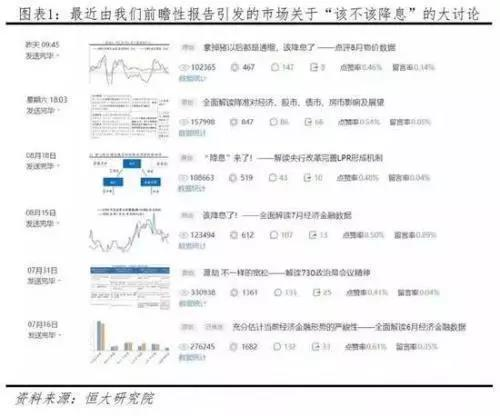

##正文

本月6日，众望所归的央行降准来了，国内的金融专家们纷纷开始鼓吹放水，认为随后到期的2650亿MLF利率也会下调。

不过很显然，中国的经济学家们普遍不懂政治，央行接下来就让那群预测放水的专家们羞愧不已，2650亿到期后不仅利率不变，额度竟然还缩量了一半。

就在各路专家因为判断错误，不好意思说话之际，“忽悠神教”的任大教主跳了出来，指着20日全国银行间同业拆借中心公布的一年期LPR下降了5bp，开始大呼：你们看，我说降息，果然降了吧......

甚至，还信誓旦旦的说中国政府已经按照他的预判，本年度两次降息.....

于是，国内一群高考数学都不及格的媒体记者们也跟着“忽悠神教”一起捧臭脚，纷纷撰文高呼央行“降息”了。

哎，见过不要脸的，没见过这么不要脸的。

如果把任大教主说的“中国今年已两次降息”的段子如果放到国际市场，恐怕老外们一色都是关爱智障的眼神，慨叹中国的经济学家们都是津巴布韦的水平了。

稍有经济学常识的人都知道，央行的降息，指的是降低金融机构人民币存款与贷款两个基准利率，而LPR不过是其中贷款体系很小的一部分，更不要说是此次利率下降的一年期LPR，规模更是微乎其微。

而就拿任大教主从事的房地产行业，无论是个人按揭房贷还是房地产企业贷款，目前一年期LPR的存量与他们相比就是九牛身上的一根毛。

这就像看到身边几个楼盘涨价，就以为全国房地产形式回暖，不知道任大教主的总坛是不是设置在夜郎，镇派绝技是否为“一叶障目”。

更不要说，今年全国按揭房贷和房地产贷款利率双双上升，如果按照任大教主一叶障目的逻辑来判断，那么今年中国是不是已经“进入了加息通道”了？

而且，随着上周的央行降准，对于此次LPR的报价，国内大部分的金融分析师都给出了5BP至10BP的预期，由于属于行业内共识，就算预期得以兑现，业内也没有什么专家出来吹自己预判正确。

而只盯着降息，都没顾上分析LPR的任大教主，竟然舔着脸把此次LPR利率下浮，包装成他预测的降息来证明自己的预判，甚至扭曲之后给中国扣上“两次降息”的帽子，这就有点不要脸了。

最近两年来，任大教主上百篇文章言之凿凿的预言降息，此番更是恬不知耻的忽悠韭菜，不禁令我产生了怀疑，他老板在这一波财政去杠杆周期内是不是有点抻不住了......

 

 

那么，任大教主忽悠韭菜的LPR到底是一个什么东西呢？

从定义上来看，LPR是商业银行对其最优质客户执行的贷款利率，通俗点来说，就是商业银行能给的最低利率。

而任大教主的老板许先生，平均融资成本高达LPR基准利率的三倍，两者之间有个毛关系啊？

国内银行凭什么把最优惠的贷款给房地产公司？LPR基准利率的贷款只会给那些国资委旗下那些毫无风险的友军。

虽然LPR肩负着未来利率市场化的重任，但目前能拿到一年期LPR基准利率的，大都是那些与银行同属国企序列，异父异母的亲兄弟。

甚至就像LPR利率的公布方是“银行间同业拆借中心”，目前一年期的LPR，看起来也很像国资机构之间的资金拆借。

而任大教主吹嘘的一年期LPR降息，不仅跟他老板的融资屁关系没有，甚至连买许老板房子的按揭也影响不到，说句难听点，《百家姓》里面，许也不过才排在20位，有什么资格去琢磨最低利率的LPR呢？

哎，看着任大教主带着他的“忽悠神教”教众这几天到处吹嘘降息，大家真要去金融机构看看就会发现，这就叫“一顿忽悠猛如虎，再看利率原地杵”。

当然，也不能怪任大教主睁着眼睛说瞎话，因为目前不少经济学家对于LPR也都是一群没头的苍蝇，闭眼胡说这是让“银行让利”。

从官方角度，LPR是全国利率市场化的一部分，是一个过渡性动作，但如果从政治的角度来，就会发现和目前的改革都是一脉相承的。

简单来说，目前推动的LPR，是在不动既有存量贷款池子的基础上，另起炉灶搞一个低成本融资的新池子，为符合国家政策方向的“自己人”提供更低廉的银行融资渠道。

而许老板的那上万亿的存量房地产信贷，不仅没有享受到LPR利率下降的红利，很可能还会受其影响导致融资成本上升，出现“加息”的效果。

被“加息”并不难理解，远的如当年的深圳特区，近的如最近的科创板，就是因为原来的既得利益集团实在是太大，中央选择新开一个盘子，以双轨制的方式前进，以后再慢慢的并轨。

而从这个模式就能明白，远如深圳从全国吸收年轻人，近如科创板从主板那里吸收资金，未来随着低风险低利率的LPR盘子扩大，必然会从传统的银行信贷里面抽血。

放眼国外，全球大量资金涌入低风险的长期美债，导致市场流动性紧张资金，高风险的短期融资成本直线上升，也是同样的道理。

未来在国内，随着银行开始推行低利率的LPR，导致损失了大量净利润，不是慈善组织的他们必然要从高风险的信贷上寻求利润补偿，这也会导致高风险的信贷融资成本也继续随之上升。

说白了，在央行没有降息产生“增量”，只有任大教主“嘴炮降息”的情况下，市场就是一个“存量”的博弈，有人受益了就必然会有人遭受损失。

受益的都是自己人，那么遭受损失、融资成本提升的企业会是谁呢？

自然就是那些不符合国家“房住不炒”政策，融资成本高昂的房地产企业了。

而首当其冲的，自然就是任大教主服务的宇宙第一大开发商，因此从这个角度来看，任大教主最近几个月魔障了一样倒也是情有可原。

最后再奉劝任大教主，这两年天天率领着一群“忽悠神教”的媒体鼓吹降息，被央妈打了几年的脸，脸皮都快练成铁砂掌了，可毫无长进说来说去还是那一套。

虽说呼吁降息是挣饭钱的工作，但也不能这么没下限，建议任大教主还是好好回去闭关学习，把真正割韭菜的神技吸星大法练出来，不要再用那张厚厚的脸皮给中国经济界丢人了。

 

关联文章：9月6日央行降准解析
 
##留言区
 

