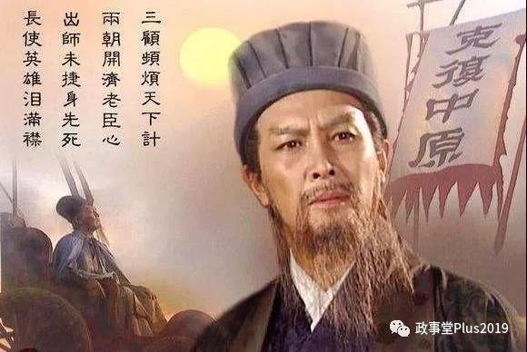

##正文

 

首先，战争永远是政治的延续。

我们要知道，诸葛亮的蜀汉政府，是一个少数派政府，主体是刘备当年一路长征剩下来的亲随。

而此时，蜀汉政府的官僚们，很多并不支持这个政府，民众对这个舶来政权也没有太多的认同感。

因此，诸葛亮的北伐，最重要的，是为全蜀国人民树立了一个道德意义上必须打击的敌人，以增强蜀汉政权的凝聚力。

在北伐的过程中，趁势整合的蜀国国内的各股力量，打击了投降派的官僚集体，在战争中淬炼出了大量有能力信得过的人才。

无论是蒋琬费祎等原来诸葛亮相府的旧臣，还是在北伐中发掘的麒麟儿姜维，均得以迅速提拔成为蜀汉政府的主要力量。

其次，成功的背后永远是以多打少。

诸葛的每一次北伐，都根据吴国北伐的时间范围来调整，这使得蜀军每一次都避开了曹魏的绝对主力。

因此，蜀魏大军的每次对垒，哪怕是惨败的街亭之战，诸葛亮一方都是以逸待劳，在自家预定的战场上开战，甚至还可以事先编一个口袋等着对手往里钻。

可以说，五次北伐中鬼神莫测的诸葛亮都是牵着魏军的鼻子走，蜀军利用预设战场之优势，不仅损失可控，还通过包饺子，先后干掉了王爽、张郃等魏国名将。

最后，则是北伐的战略意义。

回顾三国历史，很多人都没有想到，实现诛灭曹贼夙愿的，就是五伐中原的诸葛丞相。

曹魏是一个篡汉的政权，内部有着巨大的问题和分歧，短时间内没有办法消化，因此曹魏的军权长期集中在曹氏亲族手里。

诸葛亮的频频北伐，把短期的交锋变成了一个长期的拉锯战，这就使得曹魏不得不在关陇一线长期布置大军，委任一个能够统筹东部诸军事，能力上与诸葛亮对抗的超级统帅。

分裂的种子也就此埋下。

而经过诸葛亮的几轮北伐之后，曹魏亲族夏侯家和曹家的将领纷纷陨落，最终让士族代表的司马懿掌控了曹魏西北的军政大权。

诸葛亮这位三国时期最强的政治家明白，只要通过北伐抻下去，曹魏集团内的建制派和王权之间，矛盾必然会出现不可调和，自己要做的就是加速这一刻的到来。

而与诸葛亮对阵的司马懿，果然在多年后篡夺了曹魏的大权。

回顾历史，那一次曹魏内战中，无论是统领着讨蜀部队的夏侯霸逃蜀，还是防卫吴国的淮南三叛投吴，都是改变历史的最好时机。

只是可惜那个时候，诸葛丞相虽然抻垮了曹魏，但是也累垮了身体。

在那五丈原的秋风中，这位老臣兑现了出师表上的承诺，鞠躬尽瘁，死而后已。

他一手布局了天下有变的大势，自己却没有等到天下有变的那一天。

历史还会如此重演吗？

我想，不会了.......

##留言区
 

