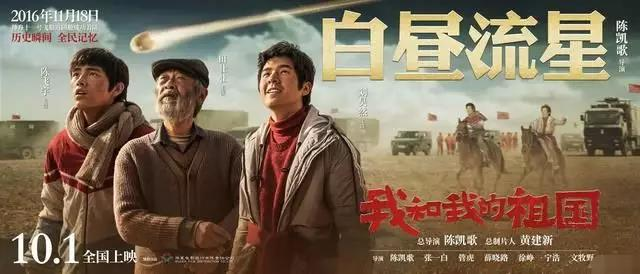
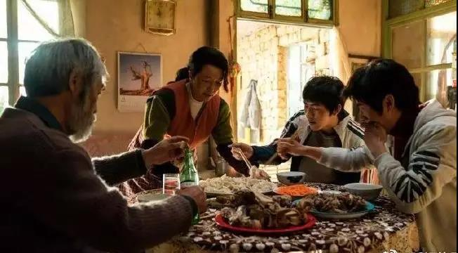
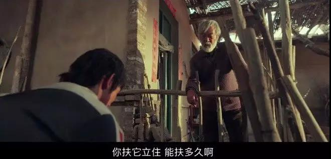
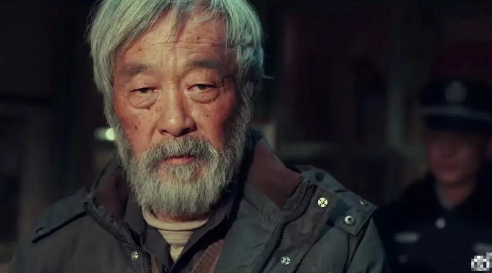
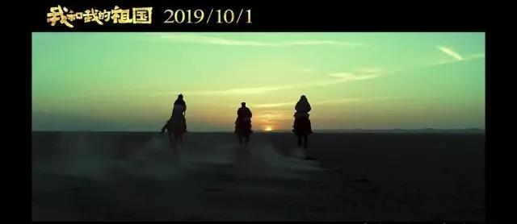

##正文

今天，身边好几位朋友都在吐槽十一大片《我和我的祖国》中陈凯歌拍的《白昼流星》，把这位大导演贬的一无是处。

虽然政事堂不是影评人，也没看过陈导的几部片子，不过从电影院走出来后，还是想替这位理想主义的导演说两句公道话。

《我和我的祖国》这部电影，一共有七个小故事。

其中，前六个故事，是按照时间线顺序走的。

1949年建国大业的《前夜》和1964年第一颗原子弹的《相遇》，是第一代领导集体完成的。

1984年女排的《夺冠》，是第二代。

1997年香港的《回归》，是第三代。

2008年奥运的《北京你好》，是第四代。

而陈凯歌负责的“神舟十一号”，发生在2016年......
    
所以，陈凯歌作为《我和我的祖国》的总导演，自然要统筹其他六位导演，而且，也只能由他来拍这最重要的一段。

而这一段，又是所有故事里面最难拍的那个。

一方面，时间轴上的这六个故事，神舟十一号的民众关注度是最低的，没有其他六个事件中的全民狂欢，无法利用潜意识玩“回忆杀”，也很难调动观众情绪。

而另一方面，这不是一部商业片，作为国庆七十周年之作，这片子是要流世的，导演必须把这个神舟故事的立意，拍成整部系列中最高的那个，要与建国大业比肩。

面对如此的困难，陈凯歌不负众望，找到了一个很好的解决方案，那就是将脱贫与神州两个事情糅合起来。

于是，这个故事明着写的是神州返回，但整篇讲的都是一个脱贫的故事。

毕竟，带领着全体中国人民实现脱贫致富，这在中国的历史长河中，意义甚至将盖过1949的建国大业。

可以说，就凭这一点，陈凯歌一招就秒杀了其他国内的众多导演。

而网上那些判陈凯歌的文章，如果作为公务员考试，几乎都是跑题作文，他们连陈凯歌的故事究竟是什么都没理解。

 

不过，陈凯歌这个非常棒的立意，又把自己陷入到一个困境当中。

《我和我的祖国》其他的六个故事，全部是中国已经实现了的成果，每一个都可以通过回忆杀令观众落泪，而中国脱贫这件事情，不仅仍处于攻坚阶段，而且也很难将成果描绘出来。

而对于陈凯歌来说，更困难的是，既要把脱贫这件事情艰苦卓绝的困难拍出来，以显示中国脱贫事业的伟大，又要沿着中央既定方针，把脱贫必定会成功拍出来，而且限定在20分钟，还要跟神州返回这件事情关联上.......

可以说，陈凯歌给自己领了一个如“白昼流星”般，近乎于不可能完成的任务.......

所以呢，那些骂陈导的键盘侠们，先自己琢磨琢磨有没有领悟到这么深，再想想就算把陈导的任务琢磨明白了，自己能拍出个什么东西来。

而理解了这些，我们再来看陈凯歌执导的这部片子。

不同于其他六部片子，主线冲突都是非常弱的，陈凯歌为了塑造扶贫攻坚之难，一开始就给自己设了一个近乎于无解的难题。

两个从少管所出来的少年，几乎是养不熟的“白眼狼”，不仅把饺子吃的一个不剩，没给老夫妇留，最后还偷了李叔的救命钱翻墙跑了。

 

换做任何一个荧幕前的观众，也许心里想的就是跟李嫂一样，报警把他们抓了。

但是，抓了他们，扭送回少管所，不就又形成了一个死循环了吗？

陈凯歌的高明之处，就在于把死棋给走活了。

网上很多人都在吐槽陈凯歌塑造的李叔不像扶贫干部，罗列了一大堆进行吐槽。

但李叔的确就不是传统的扶贫干部，对于这两个想要逃离家乡的青年，李叔想的不是给钱、算五保户，或者帮着找工作，而是从精神上，让他们真正站立起来。

对此，片中埋了不少的伏笔，就像扶羊羔的那段剧情中，李叔说的，扶（贫）是扶不起来的，得让他们自己立住，站起来。

 

看看陈凯歌塑造的李叔的政治高度，真心替那些吐槽陈凯歌的扶贫干部们汗颜，你们业务能力虽然没问题，但学习强国APP的分恐怕是不够的。

而且，陈凯歌的精神扶贫，玩的也非常巧妙。

两个没有文化的流浪少年，是听不懂什么大道理的，只是听老人们知道有个“白昼流星”的传说。

而负责扶贫的李叔就很巧妙的把神州飞船与传说糅为一体，因地制宜，带领着孩子们策马追逐着代表希望的白昼流星。

一个“宰相起于州部”的优秀县级干部，就跃然于纸上了。

 

当两个少年追到流星后，明白了这不是流星，而是返回舱时，故事就升华了，既然我们的祖国可以创造“白昼流星”这样的神迹，那为什么不能带领这里的人民将这片穷土建设成美丽的绿洲呢？

尤其当最后，说到两个宇航员也是“返乡人”时，两个叛逆少年的眼中瞬间迸发出希望，决心留下来跟着李叔一起建设家乡，影片的主旨也迅速升华，他们跟家乡和祖国，从此一刻也不再分割。

脱贫不是让贫困地区的人离开自己长大的土地，而是在李叔这样的老党员带领下建设自己的家园，让祖国各地贫瘠的土地上开出灿烂的鲜花。

可以说，陈凯歌愣是靠自己的才华，完成了一个近乎于不可能完成的任务。

 

当然，陈凯歌这部片子的确有一些需要改进的地方，不过看到很多网友把矛头指向最后神州落地后那段，我反而觉得有些心寒。

有些人，一边咒骂着阶级固化，不给自己向前晋身的机会，另一边又在质疑航天返回舱为什么允许两个小孩子进来，能允许他们抬着宇航员。

有些人，一边对“996”工作下的薪资表示不满，另一边又在质疑贫困地区的牧民为什么能够有钱骑马.......

难道，电影里面描绘出的画面，不应该是这个世界应该有的模样吗？

也许，有些人过着过着，就被社会磨平了棱角，也忘记了自己的初心。

 

朝阳下的纵马驰骋，代表的是中西部的青年们正在奔向祖国的前列，追赶他们曾经错失的时间。

因此，在飞船和牧民之间，在祖国和青年之间，从来就不应该有任何的阻隔。

祖国就像那艘神州飞船，在那里等待着策马奔来的少年，永远为她的孩子们敞开怀抱。

这就是我们一刻也不能分割的祖国。

 

##留言区
 

