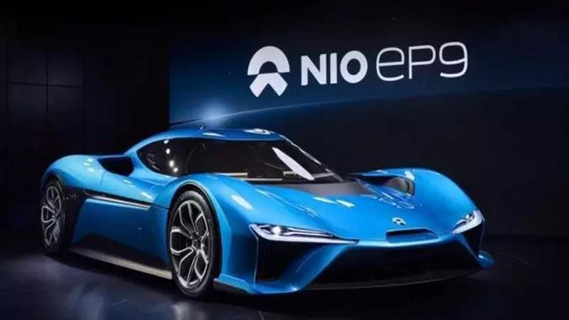
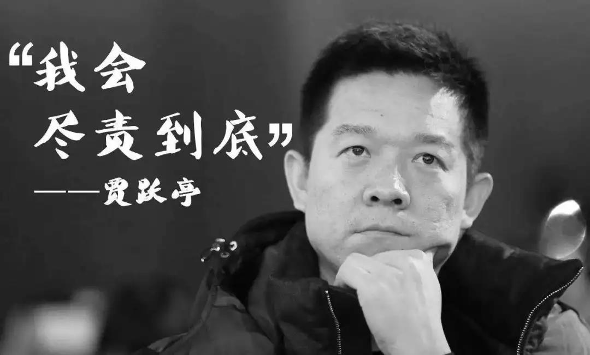

##正文

昨天夜里，蔚来汽车发布公告，CFO谢东萤请辞，公司已经开始寻找继任者以填补职位空缺。

此时，距离11月5日蔚来的三季度财报发布，仅剩不到一周。

再加上之前宣传的亦庄100亿和湖州50亿都已泡汤，一路烧钱的蔚来正面临断奶的危险。

值此危急存亡之秋，负责公司融资的CFO在公司还没找好继任者的时候，突然就“跳船”了......

受此影响，蔚来股价今天收盘时跌至1.48美元/股，距最高点跌幅超过了90%，离“1美元退市”也已经越来越近......

 

昨天的文章，通过“基建&动能”的逻辑，分析了区块链。今天，再用同样的逻辑，分析一下蔚来与新能源汽车行业的未来。

说到蔚来，虽然背后有着马化腾、李彦宏、刘强东、雷军等一群站在风口上的互联网大佬们的助力和站台，但实际上，相比于其他车企，蔚来反而不懂中国。

这个，则要从蔚来的融资体系说起。

蔚来此次离职的CFO谢东萤被业界誉为“魔术师”，曾助力新东方、京东、百盛中国等赴美上市。

尤其让蔚来成为半个世纪以来，继特斯拉之后第二个在美国资本市场IPO的车企，可以说是业界超级大牛。

因此，谢东萤的人脉和背后资源，是蔚来在美国资本市场的融资的关键。

但是，为什么连谢东萤也选择“放弃”蔚来呢？

这是因为美国的资本市场已经看明白了，他们对蔚来以及其他中国的新能源造车企业已经关闭融资的大门。

因为目前中国的新能源汽车市场，其实并不是一个toC的市场，而是一个toB和toG的市场。

而看似新能源汽车蓬勃发展，但绝大部分都被国企或者准国企自己消耗掉了。

譬如国企的北汽、广汽、长安以及准国企的吉利，旗下都有自家的出行子公司。他们利用子公司对母公司采购，“左手倒右手”就能赚取国家的新能源补贴，既不用担心国有资产损失，又能利用国企低廉的融资成本，把造车变成融资租赁。

因此，从统计数据上来看，虽然中国的新能源汽车数量一路飙升，但都是toB和toG的业务，实际上国内的toC的新能源汽车销量一直平平。

这使得看表面数据的分析师们一直都觉得中国市场很大，但能够拿到底层数据的资本家们则能清楚的看明白未来是没有市场增量。

于是，也就有了蔚来的股价跌了90%，并在美国的资本市场融不到钱，出现了危机，逼着蔚来的创始人不得不像贾跃亭那样自己往公司投钱。
 
 

那么，蔚来的未来如何呢？

在政事堂看来，虽然蔚来是互联网基因最强的新能源汽车企业，但是“互联网思维”反而成为了公司的致命伤。

因为在中国，互联网企业和新能源汽车一度都是“动能”，但如今，新能源汽车已经率先堕落为“基建”。

说起来，那些投资了新能源汽车的互联网大佬们，当时很少有人明白，他们2012年以来的飞速发展靠的是什么。

看看香港、日本、墨西哥以及欧洲的电信巨头们一色都是首富级的大佬，再看看中国的三大运营商在国资委的地位牢牢守住了倒数前三，就会明白，不是互联网大佬们有多厉害，而是他们踩中了历史的进程。

中国互联网飞速发展的逻辑，是因为政府大规模铺设4G以及提速降费，把原本属于电信三巨头应该获取的利润，转移到了互联网公司，也使得互联网大佬们把首富们的头衔从电信业抢拿了过来。

而做到了这一场财富大转移的，全球只有中国和美国，两个国家利用通讯领域的基建投入，缔造了全球领先的互联网“动能”。

同样，新能源汽车领域的逻辑也是如此。

随着新能源汽车补贴的退坡，这个行业也从曾经的动能，转变为了基建。

而这个决策，意义非常深远。

就像当年很多人觉得3G的网速就可以了，没必要上4G那样，如果按照市场行为，让环保意识远不如西方的中国消费者想要接受新能源？

开玩笑吧？！

按照市场来走，中国别说在新能源赛道反超美国了，连追赶日本和欧洲也不用去想。

因此，中国未来的新能源汽车发展，想要实现弯道超车，必然会通过强势的政府行为，就像铺设4G和5G那样，不惜亏本往前冲基建，而不是给用户发“话费补贴”。

所以，未来那些中国的国企汽车巨头们，任务就是跟当年的电信巨头们一样，工作就是把新能源汽车变成一种廉价的基建。

这使得在新能源汽车领域，中美两国出现了巨大的分歧，美国还准备用特斯拉赚钱，但是中国已经做好了新能源汽车亏本的打算。

于是看明白了的华尔街资本家们都从蔚来跑路了。

因为新能源补贴的退坡不过是表象，烧钱的蔚来突然缺钱，从高维度的国家利益角度来看，是整个行业要不赚钱的一种必然。

而当新能源造车从动能变为基建之后，还试图以互联网思维烧钱换市场的新能源汽车，一夜之间就变成了“共享单车”......

因此，在美国融不到钱的蔚来，必须要尽快回来，否则就进行一个痛苦的选择，是当摩拜还是当ofo.....

因为中国未来的新能源汽车，一定是要大规模量产的，主打的是性价比而不是高售价，试图烧钱换市场以寻求未来利润的蔚来必须要转型。

所以我们再看，又是投资足球又是投资女排的许家印，这位中国最懂政治的地产老板才会放豪言把造车定为年产100万辆。

而从这个角度来看特斯拉，就会发现一家外国公司想的都比蔚来透彻，在上海工厂就生产最便宜的Model3。

对于特斯拉这种“基建来华”，我们自然要报以最优厚的条件。

马斯克称其上海工厂20亿美金的建设费用将全部来源于中国的本土融资，而且其今年获得的85亿无抵押循环贷款，利率为基准利率的90%。

对于一路模仿特斯拉的蔚来，继续抄袭特斯拉抱大腿，这才是他未来求生之路。

最后，从国家角度“基建动能”的逻辑，再来看新能源汽车产业未来的发展。

一方面，我们试图将新能源汽车企业变成移动互联网时代的电信三巨头，政府提供廉价信贷用于其网络扩张，以降低其平均成本，特斯拉的千金马骨之后，接下来会有更多的新能源外资车企入华。

另一方面，随着大量新能源车企将生产基地放在中国，就像当年生产电脑、手机等行业那样，产业链将向中国转移，规模化的生产成本也将迅速下降，中国供应链和制造业低成本的两大优势就将迅速发挥出来，反而可以迅速向海外进行反扩张。

在这个过程中，通过中国的人口优势和庞大的消费市场，就像当年的4G手机缔造了中国的移动互联网浪潮那样，新能源汽车的普及之后，也将引领一场中国的车联网浪潮。

很有可能，这将成为中国继移动互联网之后，又一项全球领先的产业，会出现新的支付宝、微信。

所以呢，中国的新能源造车领域必须出现一轮去杠杆式的洗牌，只留下几个巨头，这样才能迅速推动行业的普及。

而对于我们来说，未来的行业机遇，并不是新能源车企本身，而是新能源汽车普及来临前，布局新能源背后巨大的产业与服务。

##留言区
 

