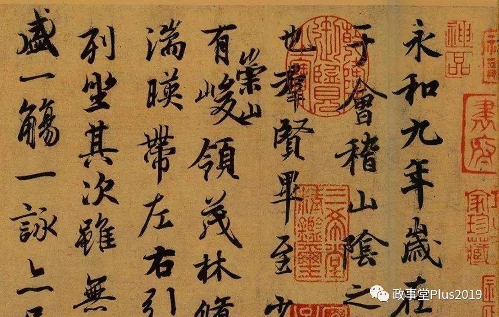

##正文

今天的文章是本系列的第七篇，主要讲的是分析古代的门阀政治，根据之前的投票结果，决定增加一些辅助阅读。

中国古代自三国之后，有两段大的历史。

一个，是隋唐之前的门阀时代，一个是自五代之后的财阀时代。

两者最直观的差异，在于其传承机制。

门阀会以“父子相继”的方式，传承给儿子、女婿甚至义子，有着非常明确的传承脉络。

而财阀多以“兄弟相承”的方式，在师兄弟、同乡、同榜、同僚之间传承，传承的机制会非常的复杂。

今天先简单聊一聊门阀政治。

依靠血缘为纽带门阀政治，从姓氏上基本就能分辨出来，譬如三国演义里面，除了罗贯中虚构的曹豹（草包）之外，书中姓曹的基本都是曹操阵营的。

而且，政治势力的传承也都是靠着血缘进行的。

曹操死后，曹操麾下的各股力量认可的不是汉献帝而是曹操的儿子曹丕。

司马懿死后，忠于司马懿的各股势力选择忠于司马师司马昭兄弟，而不是曹魏政权。

孙坚死后，其部曲虽然回归袁术，但孙策独立时他们却一呼百应。

更不要以为刘备死前跟诸葛亮说“如其不才，君可自取”，是真心话。诸葛亮专权没关系，但如果敢自立，保准被刘备麾下的各股力量围剿。

而整个三国当中，最显著的莫过于“四世三公”的汝南袁氏家族的袁绍，祖上四代有6位三公（副国级），门生故吏遍布天下。

这使得袁绍本人虽只是渤海太守（河北省沧州市市长），但袁家故吏韩馥冀州牧（河北省省长）却要在袁绍面前低三下四，甚至袁绍可以利用家族势力直接吞并自己的直属领导。

而到了东晋，中国的门阀政治到达了巅峰，写《兰亭集序》的王羲之不仅是一个的文学家，还是东晋手握军政大权的重臣，他的高位并不是因为文采好，而是因为他是琅琊王氏的子弟。

王羲之家族几乎控制了东晋的朝局，其伯父王导是东晋政权的主要奠基人，就是那个“王与马共天下”的王，另一个伯父王敦，差点让司马家把帝位让给他来坐坐。

而王羲之的老婆，也是东晋另一个顶级家族，太尉郗鉴的女儿。

而跟王羲之一起在兰亭“流觞曲水”的谢安，就是刘禹锡笔下“旧时王谢”中的那个谢，作为是淝水之战东晋的总指挥，他的麾下拥有一支忠于陈郡谢氏的部队“北府兵”

因此，那一场在兰亭的文人聚会，基本上可以理解为不带东晋司马皇帝玩的一场北.戴.河.....

 

而门阀政治，有着非常明显的利弊。

有利之处，在于门阀政治的“素质教育”非常容易培养出超级精英。

从春秋战国的诸子百家，汉朝的卫霍舅甥、班氏三杰，三国的曹氏父子、诸葛兄弟，到东晋的王导谢安，一代代的超级巨星们将黑夜照如白昼。

追亡逐北，封狼居胥，投笔从戎，鞠躬尽瘁，官渡肥水这些中国历史上最璀璨和浪漫的故事，95%以上的精彩典故都发生在门阀政治期间。

而且，门阀政治之下的庄园经济，也很容易诞生强势的军事团体，使得国家一直处于扩张的状态。

哪怕是五胡乱华时期，南方依靠着北府军最起码在被血洗之前能保住东南半壁江山，北方的门阀更是同化了入侵的少数民族建立了隋唐，根本不像财阀政治的宋明那样面对北方游牧民族不堪一击。

但是，门阀政治的弊端，跟有益之处同样的明显。

由于门阀之间很容易形成联姻与联盟，因此内部竞争就会逐步消失，政治领域丛林法则的消失，很容易形成资本之外的能力等于零的情况。

就像王羲之的儿子王徽之，是大将军的骑兵参军，到了打仗的时候，连自己的官职是什么都不知道，更不知道自己管了多少的骑兵部队。

>王子猷作桓车骑骑兵参军。桓问曰：“卿何署？”答曰：“不知何署，时见牵马来，似是马曹。”桓又问：“官有几马？”答曰：“不问马，何由知其数！”又问：“马比死多少？”答曰：“未知生，焉知死！”

>《世说新语·简傲第二十四11》

尤其是到了门阀制度高峰的东晋，“只看门第不看人才”成为了常态，造成“上品无寒门，下品无世族”的现象，形成严格的姓氏等级制度.

政治上，社会人才流动性被门阀终止，经济上，门阀的庄园大规模土地兼并，使得各类矛盾迅速激化，最终引发政局的混乱不堪。

所以呢，回顾中国历史我们就会明白，能够在逆境之中集中力量、在扩张之中调集资源的门阀政治，只有在特定时期是有益的。

而一旦令其门阀长期控制朝局，王朝很快就会从内部腐化，并迅速引发国内的混战。

而中国的历史也决定了，随着隋唐结束，一旦当中原王朝的扩张脚步停下来之后，政局也就会迅速从汉唐的门阀政治，转向宋明的财阀政治。

从历史的角度来看，冥冥之中，这也是一种历史的必然。

嗯，下一期，讲财阀

##留言区
 无留言