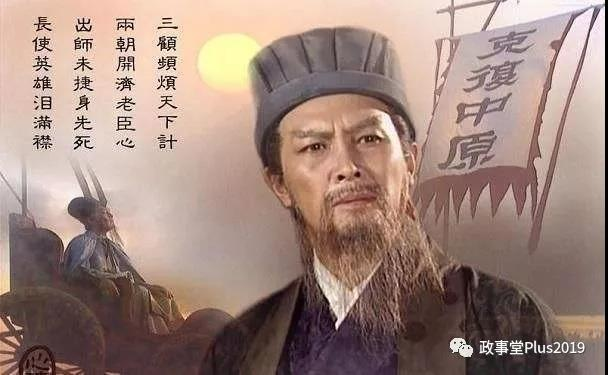
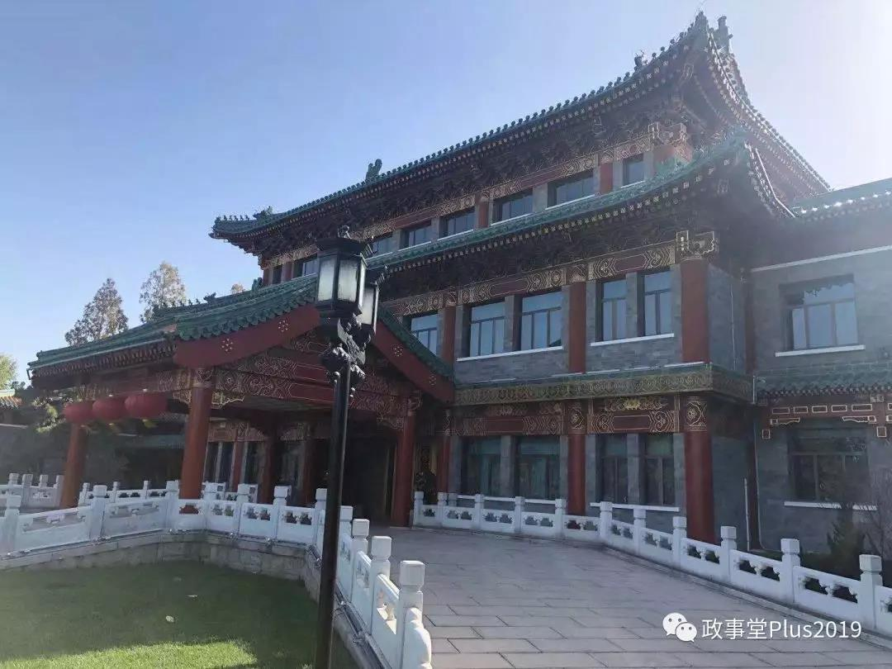

##正文

之前几篇文章讲了**发展与改革，增量与存量**之间的关系，今天做一个阶段性的收尾，写几个相对应的事例，之后再转向国外。

相信，这一篇文章又可以刷新你的三观。

中国古代改革，有一个致命伤，就是古代的科技水平决定了，**推动改革所需要的增量蛋糕，很难人为的实现。**

而动存量蛋糕改革的结果，往往就是内部形成激烈的党争，之后迅速崩溃。

因此，古代伟大的政治家们，在推动改革的过程中，普遍都会**对外寻求发展，寻求增量蛋糕。**

譬如商鞅变法能够成功，靠的是秦国不断地对外扩张，获得新的土地和人口。

扩张中巨大的增量蛋糕，使得秦国变法过程中激烈存量博弈成为了次要矛盾。

甚至后来，秦国的贵族们杀掉了商鞅，但是在巨大的增量蛋糕，以及庞大的新利益集团崛起，贵族们并没有中断商鞅的变法，而是跟着秦国的战车依然滚滚向前。

所以，如果纵观中国历史，不仅是商鞅，中国古代所有的大政治家们，在对内进行激烈改革的时候，都会选择同时对外扩张。

因为在科技无法爆发式增长的古代，军事扩张会是唯一短期可以实现的增量。

无论是秦始皇和汉武帝的北征匈奴南征百越，还是隋炀帝和唐太宗的东征高句丽，同一阶段，伟大的政治家们在改革过程中，连扩张的方向都会完全一致。

甚至诸葛亮执政后的第一件事，就是五月渡泸，深入不毛，将南中收入到蜀汉的版图，用增量解决了蜀汉外来势力与本土势力的矛盾之后，再去写出师表挥师北伐。

 

这些改革家们不是不知道战争会带来巨大的消耗，他们清楚扩张也会出现巨大的反噬。

但是，**想要解决内部巨大的矛盾，就必须寻找外部的增量。**

这就使得秦始皇与汉武帝做出同样的抉择，隋炀帝与唐太宗也成了一枚硬币的正反两面。

他们可能会存在成功与失败的差异，但是熟读历史就会发现，同一历史时期，伟大的政治家们总会有相似的选择。

而且，这种改革之初启动军事扩张的路线，进入宋明的财阀时代依然有效。

譬如宋神宗在用王安石变法的时候，启动了河湟开边，一度把西夏的大部分土地收入囊中。明神宗在用张居正变法的时候，打了万历三大征，也把宁夏收复了。

这是因为扩张的过程，本身就是洗牌的过程，有利于把那些不利于改革的人洗掉，换上来适合改革的人。

而懂了这个逻辑，就会发现研究历史必须要把政治、经济与军事三个问题放在一起考虑，才能得到一个完整的历史，否则只研究一个方向往往都是在盲人摸象。

而明白了这个道理，对于进入工业革命之后，很多超一流政治家们的决策，也很容易明白了。

因为**随着科技的爆发式发展，人口和土地不再是所有的增量，科技和资本逐步取代了人口和土地，成为第一生产力。**

所以，当年我们面对庞大的联合国军，竟然不惜血本在朝鲜半岛亲自下场跟美国人死磕了一场。

这场战争，不是为了所谓的荣誉或者安全，当时泽东同志下这个决心是因为解放战争结束的太快，国内有着巨大的矛盾，而且中国当时更是一个落后的农业国。

因此，一场抗美援朝不仅可以完成对内的改革，更重要的是，国内的存量改革必须要配合增量的发展，我们需要找到发展的蛋糕。

而这个增量靠鼓励大家生孩子实在是太慢了，想要速成，就只能从苏联那里拿到。

因此我们就只能靠交一份投名状，来换取苏联将中国从农业国变成工业国的156个援建工程。

而这一股增量的蛋糕，也使得**我们内部的存量蛋糕变得更好分了，整个50年代我们内部都是拧成一股绳往前冲的。**

同样，我们在改革开放之前，支持柬埔寨，反击越南，也并不是传统媒体中说得那么简单。

随着二战之后科技的发展，人口和土地的重要程度迅速下滑，科技与资本的力量愈加体现，**中苏关系恶化之后，中国外部的科技与资本增量骤减，因此，很快我们也陷入到了对内分蛋糕的激烈矛盾之中。**

而为了解决内部抢蛋糕的问题，泽东主席和小平同志这种顶级战略家的选择非常一致，那就是对外寻求增量，来做蛋糕。

于是，就有了1972年的尼克松、田中角荣访华，以及1979年的中美建交。

 

日本和美国先后的投资与技术转移，使得我们拥有了巨大的增量蛋糕，因此，我们也能够迅速扭转了长达十余年的内部分蛋糕博弈，开启了改革开放。

而对越的自卫反击战，以及支援柬埔寨，就是在这个背景下进行的交易。

同样，把镜头回到20年前，中国能够对体量巨大的国有经济进行改制，推动股份化和市场化，从一个个拖油瓶的国企，通过一系列的改革，变成了如今一个个在全球500强排行榜中不断刷新纪录的超级巨头。

这背后是什么呢？

一系列垄断级央企改制的大背景，是我们99年与美国签署了进入WTO的协议，入世之后巨大的市场增量，以及大量海外资本的涌入，使得国企改制这个存量经济中最难啃的骨头，变得不再那么难以解决。

可以说，这也是一个增量发展带动存量改革的典范。

回顾我们过去70年的历史，面对高速发展过程中无数次的危机，正是这几轮靠着对外做增量的模式，以发展的“做蛋糕”来解决内部“分蛋糕”矛盾，才实现了建国70年以来，中国大地日新月异的变化。

毕竟，存量的蛋糕并不好改革，譬如从房地产税到股市注册制，这些改革被拖了多少年，才在这两年开始全面提速启动。

而这些存量蛋糕改革突然速度的背后，是咱们对外的带路倡议、亚投行、RCEP、上海合作组织、进博会等一系列增量蛋糕的不断推进。

正是有着这些对外的增量蛋糕的不断增加，国内一系列难啃的骨头才得以一个个的被拿下，存量蛋糕的矛盾才会逐步弱化。

所以最后呢，我们也要感谢那位带着美国进行战略收缩的总统特朗普，正是由于他放弃了民主党花费6年时间拉起的那个包围网，才给了我们对外做增量的机会。

有的时候，有些东西来的这么的美妙......

##留言区
 无留言