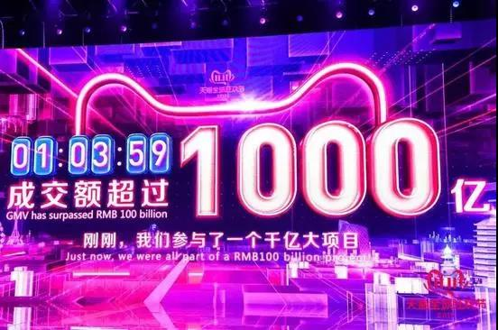

##正文

城外的人想进去，城里的人想出来。

也许，这就是今年“双十一”的一个写照。

主打一二线用户的京东，把微信九宫格入口都改成主打下沉用户的“京喜”，硬挺着巨额亏损也要做用户增量。

主打三四线用户的拼多多，则拉着一群自媒体原创大V们，针对一二线市场搞起了百亿正品补贴。

而东道主的天猫，更为了这一场盛宴，调动了整个阿里系所有的事业部一起推流量抢用户，并下大力气搞新品首发。

 

这一场电商补贴大战打下来，估计几个巨头“面子”上光鲜，但“里子”怕是都挺伤的，尤其是京东和拼多多，各项成本怕是又要上一个台阶。

不过，在政事堂看来，这一场消耗战也是必须的。

因为中国的电商平台，马上就要洗牌了。

尤其是京东和拼多多，这俩“瘸腿”的难兄难弟，必须要在短时间内强行砸钱补短板。

背后的逻辑，用政事堂惯用的“基建动能”解释，就是**电商这个行业要从一个赚钱的“动能”，很快沦为一个不赚钱的“基建”。**

就像快递行业的激烈竞争，利润逐步被几大电商拿走那样，**未来电商的利润随着激烈竞争，利润也会被金融科技拿走，这使得电商将不得不向科技金融转型。**

不过，科技金融是非常烧钱的，这对于刚实现盈亏平衡的京东，以及还在烧钱的拼多多来说会非常痛苦。

因此，哥俩想要迎接春天，就必须在资本的寒冬之下，募集到更多的粮草来推动转型。否则，随着各家白热化的价格战，卖商品的利润将越来越薄，最终沦为他人的嫁衣。

那么，电商的价值在哪里呢？在数据！

电商巨头们在销售过程中建立的庞大而精准的消费信用数据，是一笔无法想象的巨大财富。

就像过去银行针对信用卡用户的每笔消费与还款都进行计算，以此计算风险给予用户信贷额度。

未来随着电商平台了解到用户喜好品牌，价格敏感度，支付方式，收货地址......等一系列非常详细的数据，就可以将数亿用户的消费能力分类后进行精准描绘。

甚至当算力强劲的之后，根据用户消费习惯中出现的升级或者降级，电商平台都可以对用户的金融风险进行预警。

因此，在数据和算力的推动之下，拥有全国用户消费数据的电商，比全国数百家数据割裂的银行，对用户的风险信用评估能力强太多了。

未来消费贷领域有多大的利润，想一想就会咋舌。

而且，随着数据的应用，未来电商巨头跟品牌供应商的关系会更加紧密，凭借着对大数据的深度分析，品牌供应商从设计到生产，都可以按照电商给的“计划经济”进行生产，并因此上溯一整条产业链的数据可控。

这就意味着，未来掌握数据的电商平台可以用极低的风险来推动整个中国农业与制造业的供应链金融服务。

我们做一个极端假设，未来我们在天猫上买一辆吉利的新能源汽车，从曹德旺的玻璃到李书福的汽车，所有供应商都用着蚂蚁金服的低息贷款，而消费者用的车贷以及保险，也都是蚂蚁金服的金融服务。

可想而知，当整个产业链与消费者打通之后，金融科技会在整个交易中获取难以想象的巨额利润。

所以再看今年的双十一，我们就会发现一个有趣的地方，天猫京东拼多多三巨头的动作非常一致，那就是下血本给自家的数据补短板，尽可能的打造一个覆盖更多中国消费者的数据库。

而这种博弈背后也很无奈，考虑到数据库的规模化效应非常巨大，因此接下来的这场电商的数据流血战中，国内很可能只会剩下两个能够打通电商和金融平台（联盟）。

嗯，至于会是哪两家活下来，这将是一个非常有趣的话题。

##留言区
 

