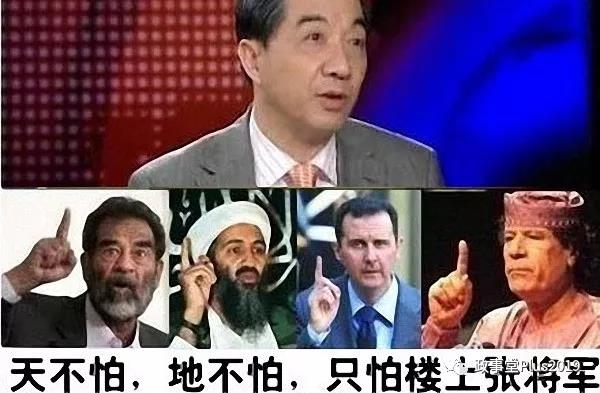

##正文

聊了好些天的国内，将镜头转向美国。

在美国的历史上，南北内战对美国造成的伤亡以及伤害，远超于之后一战二战之和。

原本如此巨大的矛盾，本应该是不可调和的。

但是随着美西战争开始，美国开始了海外扩张，美国通过一战、二战、冷战，不断的扩张其全球利益增量，内部存量蛋糕的矛盾，就退居成为了次要的矛盾。

因此，某种程度上来说，80年代迅速衰弱的苏联，一度成为了美国养寇自重的筹码，利用其继续控制欧洲和亚洲的势力范围。

以至于当年苏联解体前，最积极维护苏联政权的不是戈尔巴乔夫和叶利钦，而是美国总统老布什。

但是即使总统老布什出手，也救不了一心自尽的苏联。

 

随着苏联的解体，雅尔塔体系也开始瓦解。

西欧吸纳东欧组建了欧盟，东南亚吸纳越老缅柬四国组建了东盟，非洲各国组建起了非盟，东亚的中日韩积极构筑A3，甚至中东的萨达姆北非的卡扎菲也在试图将重塑阿拉伯帝国。

而过去打着反苏旗号的美国，再继续掠夺海外利益增量，就将站在全球人民的对立面上。

所以，美国必须重新树立敌人。

此时共和党与民主党纷纷树立起了不同的对手，以转移国内的矛盾。

共和党的老布什、小布什两届政府，都把重心选择在中东地区，高举着打击恐怖分子的旗号，先后挑起了海湾战争、阿富汗战争、伊拉克战争，在中东地区打成了一锅粥。

 

而民主党的克林顿、奥巴马两届政府，都喜欢把重心放在原苏联意识形态地区，先后挑起了台海危机、科索沃危机、乌克兰危机、南海问题，最后还差点搞成了一个TPP。

美国各股力量不停的对外折腾，原因有很多，但是如果寻求一个共同点，那就是对外转移国内的矛盾。

只不过由于经济基础和意识形态的差异，民主党和共和党选择的方向往往是南辕北辙。

但无论如何，民主党还是共和党，都在选择扩张，因为只有扩张的增量，才能弥合国内的巨大矛盾。

而有趣的是，随着特朗普的上台，扩张了一百多年的美国，开始了全面的战略收缩。

而回顾前些天的文章，我们会知道，当一个政权开始战略收缩的时候，内部存量蛋糕的博弈必然开始激化。

美国国内如今日益激烈的撕裂，也验证了这个历史的逻辑。

而正是美国的战略收缩与内部撕裂，使得土耳其、朝鲜、乌克兰以及南海的地缘焦点有机会得以重塑。

地缘重塑，又使得RCEP、欧亚经济联盟等一系列区域性联盟，以及中日、日欧、中欧等战略协同得以加速推进。

这些区域性联盟和战略协同的推动，又将进一步遏制美国对全球各地区的抽血与干涉的能力。

最终，外部增量的下滑会使得美国内部存量冲突的进一步扩大化，进一步降低美国对外抽取增量的能力，陷入一个死循环之中，党争也会越来越激烈。

因此，只要我们做好自己，就能看到陷入明末宋末式党争的美国，自己把自己玩残的一天。

而这，也是为什么“抻”，是我们最佳的选择。

##留言区
 无留言