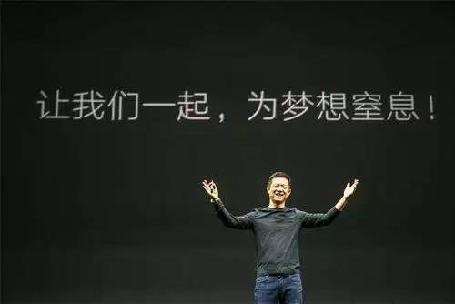
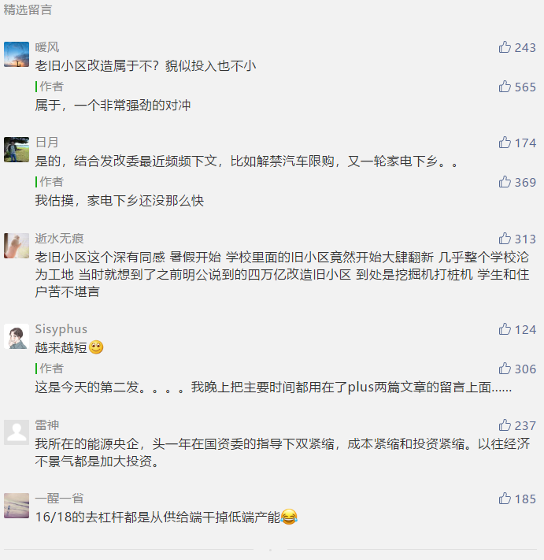

##正文

政事堂在2018年上半年的时候，做过了一个推断，那就是中国经济将从货币去杠杆向财政去杠杆转型。此后，以此为基调写了数十篇的文章并做了大量的预测。

这一年多的时间，很多与财政口相关的朋友都直接感受到了财政去杠杆的寒意，但是没有直接接触到的朋友，则普遍对财政去杠杆表示一脸的懵逼。

今天，不聊去杠杆产生的原因，用比较简单的语言，聊一下两个去杠杆的结果。

2016年开始的货币去杠杆，用通俗的话就是从供给端干掉低端产能，银监会干掉影子银行，证监会收紧了重组和IPO，保监会锁死了万能险，地方金管局封死了P2P。

最直接结果，就是过去能干的事儿如今干不了，**导致靠忽悠借钱的高杠杆企业活不下去。**

 

而且，货币的去杠杆引发的供求关系变化，货币供应不足导致**利率提升，汇率升值。**做企业的该懂都懂，我就不说了。民众能够直观感受到的是余额宝的利率一直维持在高位，进口商品的价格优势明显，海淘爽到爆。

而2018年开始的财政去杠杆，用通俗的话说，也是从供给端干掉低端产能，国开行减少中小城市的棚改，财政部减少了对中小城市的PPP，发改委减少了对中小城市的基建批复。

直接的结果，也是过去能干的事儿如今干不了，**导致靠忽悠吃财政饭的企业活不下去了。**

而且，财政的去杠杆引发的供求关系变化，货币供应过剩导致**利率降低，汇率贬值。**做企业的该懂都懂，我就不说了。民众能够直观感受到的是余额宝的利率长期低位徘徊，进口商品价格提升，海淘突然就不给力了。

而明白了我们正在从货币去杠杆转向财政去杠杆，就会发现很多政策的逻辑是透明的。

譬如，面对货币供应充足，央行在今年推出LPR的利率双轨制，压低优质企业的利率，然后大规模的封锁信托等房地产融资通道，因为中央不希望实际利率下降的红利被大型房地产企业拿走，造成房企的继续扩张和房价的上扬。

同样，上交所推出的科创板这个增量也是货币供应充裕的这个背景之下推出的，有了这个增量，在券商的帮助下，就可以避免对主板的抽血。

甚至一二线城市群开启了大规模基建以及接下来的5G基建，都是在这个廉价而充足的货币供应背景之下进行的。

另一条线，随着汇率的贬值，很多企业的生存也会出现巨大的变化，譬如搞进口的网易海淘自然就撑不下去，而搞出口的不少企业避免了贸易大棒造成的威胁反而可以进行积极的扩张。

不过，最头疼的问题，是两轮去杠杆，都是供给侧改革，因此货币去杠杆周期中小银行很受伤，财政去杠杆周期中小城市很受伤，而**中小银行和中小城市恰恰又都是紧密关联了.......**

所以，一方面，中小城市所消费的房地产、汽车、家用电器等受到冲击属于历史的必然，明年预计还会加重；而另一方面，国家向中小城市的转移支付与花式补贴未来必然会加大力度，也会诞生新的机会。

接下来的很多走势，都是明牌，因此历史的进程就摆在面前，机会大家各自把握吧~~~~

今天的正文似乎应该算是：顾子明闲扯西游记（二）

##留言区
 

