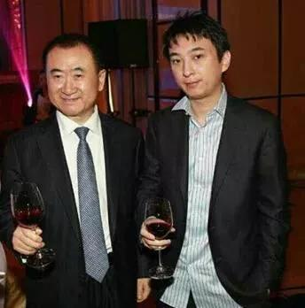

##正文

昨天上午，跟群里的一些朋友聊了一个问题，为了预防危机而屯粮，是应该股权融资，还是债权融资。

令政事堂诧异的是有几个朋友依然建议选择债权融资，于是，便有了昨天那一篇分析为何马云要搞股权融资的文章。

 

**毕竟，股权融的钱，是不用还的，而债权融的钱，却是要还的。**

而还钱的时间点，对于一个企业来说非常重要，一旦危机爆发，还钱的时候大家会发现很难再能借到钱。

就像前两年贾跃亭和王健林手握那么多国内一流的优质资产，却被搞了个墙倒众人推。根本原因就是他们前期过渡依赖了债权融资，而后期的股权融资的口子被封死之后，导致了债务错配。

结果，只要一个债权人开始冻结他们的资产，就会导致多米诺骨牌的垮塌。

所以，从这个纬度，我们再来看国内很多经济学家和金融从业者抨击的科创板，就会理解中央的高瞻远瞩和用心良苦，以及国内金融从业者的意识水平有多令人头疼。

抛除蚂蚁金服等龙头企业外，目前国内科创板企业论资产质量，普遍还不如乐视和万达，因此假如遭受经济寒潮，债务危机风险迅速提升，在信贷支持不足的情况下，很容易重蹈当年万达乐视的覆辙，要么甩卖资产，要么关门大吉。

而科创板企业的方向又是中国未来经济发展的方向，是未来的国运比拼，因此，创立科创板，是国家为这些祖国未来的栋梁们特批开了一个股权融资的平台，是为了给他们未来遭遇风浪时，能保驾护航。

同样，国家很多的良苦用心，在最近很多的动作中都能体现。

直接能管理到的央企，能够上市的都推动上市做股权融资，连京沪高铁这种印钞机都必须上，而已经上市的，则在强力推动修补资产负债表。

而且，央行强制推行LPR计价，为的不断降低优质企业的融资成本。（不出意外，明天LPR又要降了）

而无法直接管理的如房地产企业，则一方面通过发改委锁死了他们的海外债务融资规模通过证监会锁死了房企的上市融资，另一方面死死的控制住国内的房价并按住了经济学界高呼的降息。

至于各种虚拟经济，从影视到游戏都遭遇了凶猛的打击，也禁止了他们的股权融资。

这一系列调控的结果，就是曾经风头无限的老王和小王一起低调做人了.......

 

当然，这次并不是打击，而是对他们的保护，譬如万达电影重组的股权融资，今年最后还是批准了。变相也是在推动民营企业自己主动去修复资产负债表。

而这个逻辑同样也适用于国家，东南亚国家和日本韩国为啥能顶住美国的巨大压力拉着中国签署RCEP。

看一看1997年的东南亚危机就会明白，所有签署的国家都是有着切肤之痛，甚至印尼的马哈蒂尔、日本的安倍晋三和新加坡的李显龙，这些大佬们都是22年前冲击的直接受害者。

因此，从这个角度来看，RCEP对于他们来说也是一笔重要的“股权融资”。

好了，写了那么多国家和企业，对于个人有什么借鉴意义呢？

这里举个例子，前段时间跟一个小姐姐聊天，她说看了我的去杠杆之后，觉得应该把手头上那些房子的贷款都提前还了，这样杠杆率就降下来了。

我听完不禁头大，这位小姐姐的操作其实恰恰反了，**面对可能的风险，最好的方式，反而是尽可能的“加杠杆”，卖掉全款持有的房产换现金，同时，手握按揭贷款的房产是最佳的选择。**

而这也是为什么政事堂在2017年以来对于房地产的“精分”，一方面让有多套房子的人找机会高位抛售，另一方面又让刚需看到骨折价就买的原因之一。因为刚需往往都是加杠杆的贷款，而拥有多套房产的多半都是无杠杆的全款。

这里可以做一个形象的比喻，那就是马云香港继续增发股份，但还能6%的股权控制了阿里巴巴，然后手握数千亿的现金。同样，普通人也应该用30%甚至更低的首付控制你所持有的房子，持有更多的类现金资产或者便于快速变现的资产。

原本就不缺钱的马云，他从资本市场上融到的现金，可以在寒冬来临之际，廉价买入大量的资产，同样，对于普通人来说，尽可能用别人的钱购买资产，而让自己手握更多的现金便于待价而沽。

嗯，今天文章写完了，说的很通俗，相信绝大部分读者都能懂。

就像周期天王周金涛说的，人生有三次财富机会。

希望读政事堂文章的读者们不要错过，因为每一次的混乱，往往就是大家晋升的阶梯....

近期关联文章：

财政去杠杆周期下的机会

马云为何再次选择了香港？

王思聪的陨落，背后发生了什么？

##留言区
 无留言