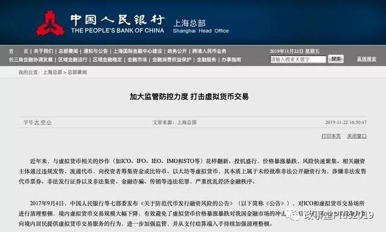
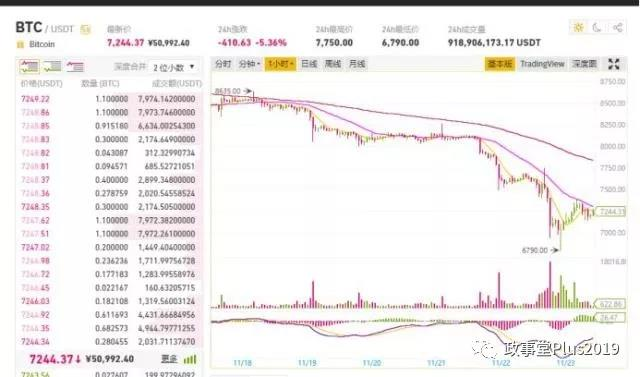

##正文

近日，随着人民日报，新华社，央视网等媒体聚焦区块链乱象，呼吁投资者警惕数字货币骗局，各级监管也纷纷“亮剑”。

 

币安，波场微博被封，多个数字货币交易所先后被突击，BISS被定性为非法集资诈骗，成为首个全员被端的案例。

受此影响，一批空气币被下架，比特币迅速跳水，一度跌破7000美元........

 

还记得政事堂在今年8月底的时候，建议持币的跑路，从业的转行么？

嗯，三个月后，不仅有不少空气币已经人间蒸发，部分币圈的从业者恐怕再想转行都没那么容易了，那些交易所的员工均会被登记在册，甚至连BISS刚入职数月的实习生都被警方控制了。

这就像网上流传的那个段子，正规军要入场，要获得百姓拥护、信任，首先就要赶走割韭菜的土匪。

 

那么，这些场外的数字货币接下来会怎么走呢？

政事堂看来，我们观摩一年前我们是如何围剿P2P的，也许就能一窥端倪。

从去年六月开始，P2P在调查之下的暴雷开始，监管层从未试图对P2P一网打尽，除了那些本就打着集资诈骗的组织之外，大部分都是在推动他们的良性退出。

毕竟，无论是P2P，还是数字货币，里面都有着大量民众的财富，如果不分青红皂白一起打击，势必会导致整个体系的迅速崩盘，反而造成了民众资产的流失。

因此，政事堂推测，我们对数字货币圈乱象的打击有可能与打击P2P乱象类似。

首先，是通过媒体和公安力量断掉整个领域的增量，并对其中已经违法犯罪的群体进行调查打击。

之后，再对其中的存量推动良性推出，尽可能的保护民众在其中的财产。

最后，对那些仍然存在的正规机构，降规模、降人数、降点面，有序地去推动转型，有的甚至可以成为体系内被监管的一员。

而这样，才能更好的维护所有人的利益，推动行业的良性发展。

所以，我们再来看，就像从政事堂8月末看到要收拾币圈，到后面虚拟币价格的跳水，中间有足足一个月的时间。甚至随着正规军高调入场，到收拾各路交易所，中间也给了一个月的时间。

可以说，在这段时间内，我方监管给了中方数字货币资本足够多的时间和机会，可以先于全球其他组织高位跑路。

毕竟，再不听话也是自家的孩子。

但是，在主流媒体和监管层这么多轮的教育下，还不改正，那么，就别怪家长们往死里揍了......

近期关联文章：

蔚来汽车、比特币、桂林房价，手拉手一起跳了

救救炒币的80后，90后都去炒鞋了

##留言区
 

