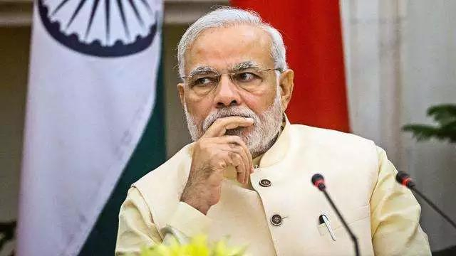

##正文

近日，在最后时刻退出RCEP的印度，后院起火了。

据环球时报援引《印度快报》报道。

>15日在德里贾玛清真寺和印度伊斯兰大学爆发反对“新公民法”的骚乱，造成至少100人受伤，警察逮捕了超过50名学生。在西孟加拉邦，示威者至少破坏了15座火车站，并阻塞了全邦的道路。在南德里地区至少6辆公交车和50辆私家车被焚毁。

>为应对骚乱和冲突，印度政府部署军队进行宵禁，关闭了12个区的网络。持续的冲突和骚乱造成至少6人死亡，多人受伤，其中4人被警察打死。

 

而这场突如其来的骚乱更是使得日本首相安倍以及孟加拉国的内政部长、外交部长先后取消了访问印度的计划。

导致这场大混乱的，就是印度刚刚通过的新公民法。

虽然这只是针对地方性移民的一部法律，但是其中对穆斯林的歧视以及背后推动印度与印度教的一体化，迅速加深了印度境内穆斯林群众的担忧，恐惧未来印度政府甚至会将穆斯林排除在国籍之外。

说起来，印度有近两亿的穆斯林，在近期印度经济不好的情况下，莫迪如此强推这个可能导致国内民众分裂的法律，把很多人都搞得一头雾水。

但这背后也并不难理解，就像当年克林顿轻松战胜携解体苏联之威的老布什时说的那句经典名言，“笨蛋，问题是经济！”

莫迪此举的背后原因，也是经济。

 

莫迪是靠着经济许诺上台的，自其上台以后，有点类似于中国的08年，靠着巨额的投资与负债，印度经济取得飞速的发展，也获得了民众的强烈支持。

但是，债务驱动的发展都是虚胖的。

自今年以来，印度经济的隐患开始暴露，出现了断崖式下滑，三季度GDP增长率腰斩为4.5%，创下了莫迪上台以来的最低水平，使得莫迪及其人民党的曾经爆表的支持率也开始迅速下滑。

考虑到日前印度在最后时刻退出了RCEP，这意味着对外经济增长的增量没有了，莫迪就只能从存量角度动脑子了。

可惜，印度不是中国，一没有完成土改，很难通过向农村转移矛盾的方式解决危机，二没有建立分税制和转移支付以理顺央地关系，让中央可以集中财力进行战略领域投资。

这就使得莫迪只能通过非经济手段，来解决经济问题。

不过，考虑到莫迪既没有胆量去打破印度的种姓与阶级，也没有勇气去对各个地方势力去整合，因此，就只能把矛头指向国内的民族矛盾了。

对于莫迪来说，激化国内的民族矛盾，反而有利于他的人民党，因为在印度信仰印度教的人口超过80%，而信仰伊斯兰教的人口只有15%。

新公民法的冲突，一方面可以转移经济下行的矛盾，避免民众把矛头指向莫迪政府，另一方面印度穆斯林群众的不冷静行为，也会使得莫迪政府的经济下行有了替罪羔羊。

准确来说，是莫迪利用民粹主义转移了矛盾。

更巧妙的是，莫迪此举有可能会诱导印度国大党本着“反对执政党”的思路，直接站在了印度80%民众的对立面上，轻松化解人民党一度岌岌可危的选情。

而且，莫迪利用民粹不仅可以向国内转移危机，更可以拥有足够多的的借口，随时随地的向海外转移危机。

因为新公民法将使得印度成为全球印度教徒的祖国，未来任何信仰印度教的人都可以随时成为印度人。

这也意味着，未来莫迪将可以高举印度教民族主义去干涉他国内政，从周边克什米尔地区、巴基斯坦、孟加拉国、斯里兰卡、尼泊尔、马尔代夫，到东南亚的马来西亚、印尼、菲律宾.......

看一看高举着“大突厥主义”的到处惹事儿的土耳其埃尔多安，甚至出兵叙利亚打库尔德武装就会明白，随着莫迪推动印度教的民粹主义，未来印度也会学着土耳其那样，在有信仰印度教人群的地方指手画脚，甚至大秀肌肉。

未来一旦印度国内选情出现问题，莫迪也可以随时随刻诉诸于武力，就像今年印度地方选举之前，莫迪就制造借口跟巴基斯坦在克什米尔打了一仗。

而这也是孟加拉国和日本先后取消了对印度的访问的原因。

对于印度的邻居孟加拉国来说，法律的通过意味着未来莫迪有足够的借口干涉孟加拉内政，同样，对于安倍来说，日本最重要的市场东盟国家也将处于印度的干涉范围之内，决不能此时访问，否则是变相给莫迪的政策站台。

不过，莫迪此举虽然能够给自己带来巨大的支持率，但是民粹这把双刃剑带来的伤害也是巨大的。

随着国内骚乱，印度经济整体上必然要受到冲击，不仅影响本国经济与投资者的信心，也会影响到与周边国家的贸易。

而且，随着未来印度以保护国民为由干涉他国内政以及跨境打击恐怖主义等措施，虽然印度民众会在印度崛起的过程中享受到自豪感，但印度的地缘外交将会迅速恶化。

而对外的干涉和与周边国家关系的下滑，必然会使得印度这个不结盟运动创始国打破不结盟，外交上迅速向美俄靠拢，以追求更多的大国外交协作。

这意味着被民粹主义和大印度主义威胁之下的南亚和东南亚国家，必然要进一步寻求除美俄印之外的第四方力量作为制衡，这又会推着大量的南亚和东南亚国家积极寻求与东方大国的外交与经贸合作。

而且，随着大印度主义的推行，有了出气筒的印度不会再像洞朗那样撞一头包，而会去捏那些软柿子，我们跟印度的矛盾将会大幅化解。甚至我们在调节印度与他国矛盾的过程中，由于有大量的筹码，反而会使得我们和印度之间的关系更加紧密。

说起来，这一场百年未有之变局的背后，就是全球民粹主义的迸发，各国的外交政策都变得不理智，此时只要我们自己控制好经济，遏制住民粹，走好自己的路，就是遍地的机会。

看着特朗普带动美国转向民粹之后，欧洲的法德意、亚洲的日韩新，这些受到冲击的国家都突然变脸主动与我们交好；同样，随着埃尔多安带动土耳其拥抱民粹之后，受冲击的中东王爷和中亚国家也都坚定站在我们这一边。

历史告诉了我们，民粹主义是全球混乱的深渊，但也是我们进阶的楼梯。

近期关联文章：

从电影黑客帝国，看全球的特朗普效应

##留言区
 

