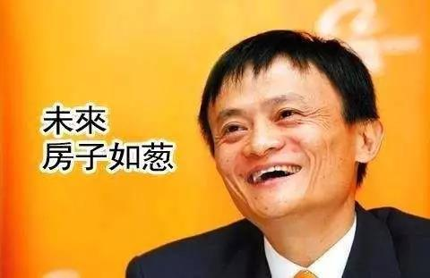

##正文

在昨天的浙商上海年会上，浙商总会会长马云爆出，2019年很多企业家都不容易，一天来了5个借钱的电话，一个礼拜要卖楼的朋友大概有10个......

说起来，刚刚以2700亿蝉联福布斯富豪榜榜首的马云，他的朋友们问他借钱可不是千八百万的，同样，那些找马云卖楼的肯定也不是几套二手房。

估摸马云要是把这几个借钱人的姓名一公开，然后说自己没借，第二天怕是A股不少上市公司的股价都要来一波断崖式下跌。

当然，大部分人都会把这事儿当作段子，不过政事堂却嗅到了不一样的味道。。

作为浙商总会的会长，商会上下几百个企业家可都是有马云的电话，更不要说退休后的马云开始了全国的云游，到处结交企业家伙伴，前两天的湖北商会活动上还兼任了湖北省政府的股东。

因此，马云公开场合把借钱这事儿一挑开，在形式如此差的19年，怕是会有更多的企业家小伙伴拨通马云的电话，也会有更多的地产商想要找马云帮忙卖楼。

就算马云退休后再闲，也不会平白给自己找这个麻烦，因此如果政事堂推测没错的话，这位中国首富是真的准备借钱和帮人卖楼了。

政事堂在2019年曾预测过2020年的房地产市场，结论是一季度部分重点城市可能会有一波小阳春，但是年中却将是大部分房地产企业的一个大考。

考虑到明年银行的房地产信贷不会放松，很多中小地产公司能不能撑过去，也就看今年的这一波小阳春带来的销售现金流了。

而在这个情况下，马云梦寐以求切入房地产的机会，也就来了。

就像2003年国家经委给国务院的报告中说的那样，全国供求基本平衡的商品有87种，供过于求的商品有513种，没有供不应求的商品。

同年，马云创立的淘宝能够成功，背后实际上是随着中国进入WTO，承接了大量的产能之后，出现了全行业供过于求的局面，马云的淘宝恰逢其时的出现，填补了国内多如牛毛的制造业企业急于去库存的需求。

而马云自从创立淘宝以来，一直想切入的房地产领域，几次试水均失败的背后，则是中国从2003年开始启动了土地财政之后，中国的房地产行业开启了一波十多年的大牛市，行业没有遭受过长达一年以上的寒冬。

这些年来，房地产领域一旦出现库存高企，靠土地财政运转的政府比开发商还着急帮忙去库存，因此国内一线开发商少有揭不开锅的时候，自然也不会愿意跟马云建立长期的合作，出让核心的数据与资源。

毕竟，看着曾经牛逼哄哄的四通一达纷纷变成变成了阿里系的“长工”，赚惯了快钱的开发商不可能接受马云的苛刻条款。

不过，随着中国在2018年下半年开始进入到财政去杠杆周期，货币化棚改与房地产企业融资先后收紧，全国房地产企业开始品尝到冬天的气息，一波波的房企为了现金流开始了挥泪大甩卖，融创的孙宏斌也成为全国最著名的接盘侠.....

这个时候，马云的机会自然也就来了。

今年以来，很多房地产企业们为了生存开始了大幅的降价和折扣，甚至把前些年重金抢到的黄金地块也挥泪甩卖，这时候，自然也就会愿意接受马云卖房的一系列苛刻的要求。

而随着这两年，一方面随着阿里体系的数据化，阿里在推广方面的用户画像越来越精准，推介房产的时候可以利用电商数据进行精准营销。

另一方面，随着蚂蚁金服的崛起，阿里在金融信贷方面也拥有了全面的布局，跟国有银行建立起了基于科技方面的深度合作，可以为开发商和用户提供一站式的房地产金融服务。

简单来说，就像马云昨天在商会上喊话的那样，可以借给你们钱，也可以替你们卖房子，但是需要按照他马云的规则来。

未来天猫上卖商品房也跟淘宝卖商品一样，由“支付宝”来做担保，未来交房时出现问题之类的，支付宝留存的违约金也可以直接赔付。

凭借着天猫的消费大数据，蚂蚁的配套金融服务，以及支付宝的信用体系，未来马云有机会趁着这一波财政去杠杆周期，深深的改变中国房地产的销售模式，将房产交易从线下集体搬迁至线上，并让购房者拥有了更为安全的保障。

如果马云真的做到了，看看过去十多年淘宝天猫如何冲击将传统零售业的价格体系击溃，那么在地产领域，马云也自然兑现了当年吹的一个牛逼：

"未来，房子如葱"。

 

只不过后半句，可能他没好意思说，那就是：“都归我割”.....

 

##留言区
 

