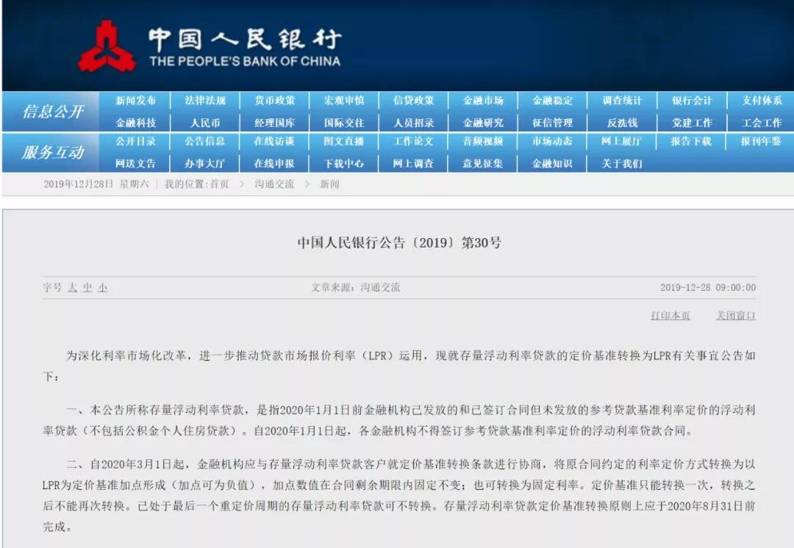

##正文

今天上午，人民银行发布了30号公告，要求推动存量贷款转为LPR计价，原则上应于2020年8月31日前完成。

具体还款模式届时只有一次的选择机会。

 

根据官方统计，去年年末我国个人住房贷款余额为25.8万亿元，因此政事堂估计，今年的房贷余额估计将超30万亿。

这意味着全国各家商业银行要在接下来的半年多时间里，要将这30万亿贷款一笔笔的签订补充合同，嗯，估计明年不少银行基层员工们要在离职和疯狂加班之间做一个痛苦的选择.......

同样，全国数千万个背负着房贷的家庭，也将面临一个选择。那就是从明年3月1日开始，可以选择将房贷利率转换为LPR加点，或者转变为固定利率。

今天，很多朋友都在问政事堂，应该如何选择。

政事堂给大家的建议和几个月前一样，那就是要转为LPR，而且，与银行签订的利率变化周期越短越好，最好是按照1年期来调整。

这么选择的原因很简单，那就是未来我们的LPR利率有着长期下降的趋势。

按照现行机制，贷款补充合同确定了加点之后，加点数字就不再变化，这意味着随着LPR利率的长期下滑，大家身上背负的房贷利息将会越来越少，也意味着合同确定的调整周期越短，大家享受的利率下滑也就越多。

这对于已有房贷的用户是一个利好，政事堂建议尽量不要选择提前还贷，除非没剩几年。

不过，相比于传统意义上银行房贷利率下行对房地产利好，此次转LPR对于房地产行业来说未必算是利好。

这是因为银行的按揭房贷也变成了存量市场和增量市场，实际利率下降的是存量市场，而开发商需要的是增量市场。

银行肯定比老百姓算的明白，在知道未来LPR利率下行的情况下，为了利益的银行恐怕很难再给出高折扣的利率，未来可能会导致全国新签按揭房贷利率出现上升的局面。

好了，民生方面讲完，再聊一聊LPR利率市场化背后的国家大势。

个人房贷占据了银行信贷规模的20%，如此大规模的转换LPR的同时，再推动银行主动下降LPR利率，将会严重损害银行的利益，因此很多金融大佬判断明年央行会下调基准利率“补偿”银行。

不过，政事堂看来，在全球经济不出现重大变故的情况下，经济学家们再怎么呼吁，央行很可能也不会降息。

一方面，央行搞LPR就是为了双轨制，在不降息的情况下去推动实际利率下行，因此如果没有很急迫的事情，没必要让自己白忙了一圈。

另一方面，LPR下行的确极大的损害了银行的利益，但是各个银行吐利益的过程中，中央也提供了其他方面的补偿。

我们可以对比一下90年代分税制改革。

当年，大家都以为税源第一大户的上海会阻力最大，但是在理顺了晋升机制之后，上海反而成为了交税最积极的省份和转移支付的第一大户。

所以呢，看看最近一批国有银行的副行长，纷纷下调到省里面，出任分管金融的副省长，就会明白，接下来央行以LPR推动的利率市场化，也有能力让银行强忍剧痛支持。

而这些痛也是值得的。

就像上海通过分税制对内地庞大的转移支付，看起来短期是上海亏了，但长远来看，反而为上海缔造了庞大的内需市场。

同理，LPR利率的市场化，短期内是银行利益受损，但长期来看会缔造更多有竞争力的中国企业，他们将为银行提供了更多高附加值的业务。

只不过，这次的痛恐怕会来的比较急，刚被去了一波影子银行损失了大笔利益的银行机构，接下来又要在几个月内完成30万亿的房贷转LPR。

没办法，我们自2013年就开始推动利率市场化，但实际上LPR机制却是在今年才正式推出，而推出的背景，则是我们今年对外宣布的那样，将开始大规模的金融开放。

今年以来，银保监会已经批准了数十家外资银行和保险机构的筹建、开业申请。而两个月前的10月15日，国务院公布了修改银行和保险的准入条例，大幅放宽了外资金融进入中国的门槛。

过去，中国的金融机构在一系列的门槛保护之下，相对于国际，形成了一套独立的国内市场，养出了一大批的温室花朵，如今，这两个金融市场也将慢慢的开始并轨。

当年，随着中国开放市场，进入WTO，原本落后的中国制造业经历浴火重生，面对市场我们血拼成本，用了十多年的时间，成为了世界工厂。

如今，随着中国的金融开放，未来几十年，中国的金融家们也将与全球资本巨鳄们开始一场面对面的比拼。

温室里面长不出参天大树，想要在未来的市场博弈中取得胜利，就必须要让中资金融机构们，尽早开始市场化的搏杀，尽早通过金融科技来一场弯道超车。

回顾90年代的那一拨改革，也许，这就是LPR定价机制设立的初衷。

##留言区
 

