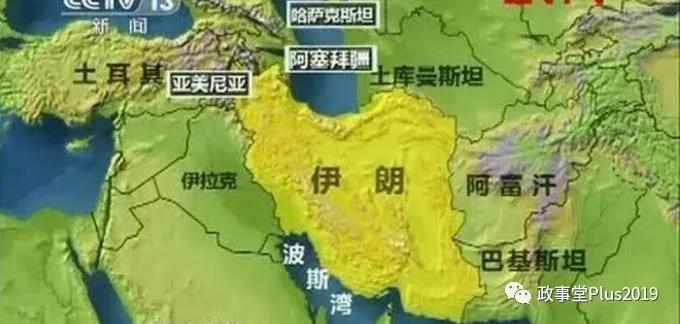
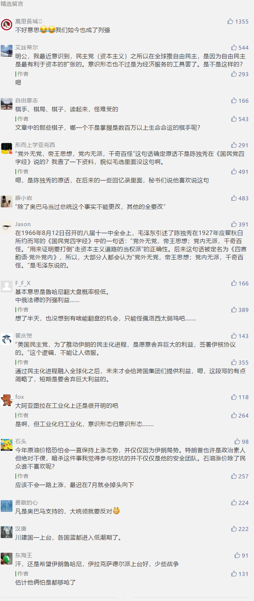

##正文

政事堂在国际时政方面并不专业，很多时候也是在一边摸索一边学习，不过，相比于绝大部分国际时政号喜欢把一个国家拟人化，政事堂的分析过程中，更喜欢把这些国家拆分成若干股不同的势力。

原理很简单，就是教员的那句话，“党外无党，帝王思想，党内无派，千奇百怪”。

就像特朗普也有一个老巫婆佩洛西带着一群民主党盯着他怼，几乎特朗普做的事情都反对那样，任何政治人物也必然有他的政治对手，而且也只有这样，才能够形成权力的平衡。

而美国作为全球的霸主，自然而然的就会将自身的意识形态投放到全球各地。

譬如说最近热议的伊朗，其实国内是分作1号人物哈梅内伊的保守派和2号人物总统鲁哈尼的改革派。

希望推动普世价值的美国民主党，为了推动伊朗的民主化进程，是原因舍弃巨大的利益，签署伊核协议的。

因此，伊核协议的受益方，是获得美国民主党利益扶持的伊朗，以及中俄法德这些利益均沾的列强，唯独没有美国以及美国的中东盟友们。

所以，才有了奥巴马需要把小弟们叫到戴维营挨个做工作。

而民主党推动的伊核协议，投射到伊朗，结果就是鲁哈尼代表的改革派势力迅速扩张，哈梅内伊以及宗教保守势力受到了严重的冲击。

本来呢，按照历史的进程，随着伊核协议带动的西方资本进入，伊朗的改革派应该越来越强劲。

可是随着特朗普上台，撕毁了伊核协议，封锁带来的伊朗人民对美国的不满，使得伊朗的保守势力重新抬头，重新压过了改革派。

尤其是此次苏莱曼尼死在共和党人的手里，仇恨使得伊朗的保守势力更加强劲，不出意外，接下来伊朗的议会选举以及总统选举，均会以保守势力大胜而告终。

所以，从美国的角度来看，特朗普葬送了奥巴马付出巨大牺牲试图改变伊朗政治生态的伊核协议。

而从伊朗的角度来看，特朗普重创了伊朗的改革派。

因此，接下来各方势力的动作特别有趣。

伊朗的保守派要大肆宣扬对美国的仇恨，但是却要避免跟美国全面开战，以完成对内部改革派的压倒性优势，并尽可能消化苏莱曼尼这几年的什叶派地缘果实。

而伊朗政府的改革派要想尽办法拉着六方会谈的各个利益方重启谈判，毕竟，经济基础决定上层建筑。今年的议会选举的崩盘已经无法避免，只能争取明年的总统大选。

但问题是，中俄法德的列强利益都满足了，伊朗的改革派靠什么让特朗普的共和党愿意像民主党那样无条件的付出呢？

尤其是苏莱曼尼死，任何的妥协都会被视为叛国。

更不要说，伊朗的保守派又怎么会让改革派与美国的共和党完成协议？

这就是伊核问题的死结，伊朗总统鲁哈尼想要翻身，重启六方会谈，也许只能赌今年年底民主党干掉特朗普.......

 

##留言区
 

