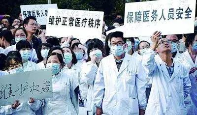

##正文

看到今天新闻，武汉十余名医生也被感染冠状病毒，令我非常的痛心，因此今天思考后，写一篇文章，探究如何从根本上解决医闹。希望能为中国的医疗行业尽一份心。

1997年，亚洲金融风暴爆发后，对于危机中政府的货币政策，“蒙代尔不可能三角”突然就火了，这个概念简单说，是一个国家不可能同时满足资本流动自由，货币政策独立和汇率稳定三个目标。

而随着近期连续的医生谋害事件暴露出的医患问题，很多人也发现，目前全球的医疗行业也出现了一个“不可能三角”，高效的应对、低廉的价格、优质的服务三者也是不可兼得。

对此，美国选择了优质的服务和高效的应对，结果是很多贫困家庭得个病就要面临破产，甚至有救护车上醒过来，害怕付不起的账单挣扎着要下车的案例。

欧盟等发达国家则普遍选择了低廉的价格和优质的服务，可结果就是生病需要排队等，很多人轮到的时候，要么病情加重了，要么就已经自愈了。

至于中国，则选择了高效的应对和低廉的价格，医保能报销大部分的费用，除了北京的几个热门医院外，看病基本也不用预约，可结果就是服务渣到家，一个大夫两三分钟搞定一个病人，还逼着病人家属跑东跑西。

虽然全球主要国家的每一种医疗体系都有被吐槽的地方，但本质都是在选择符合自身的机制，全球的富人们大部分都集中在美国，自然就会忽略价格；其他发达国家普遍是中产阶级占据主导，自然会追求公平，预算不够就大家就一起排队。

至于中国，虽然我们的GDP总量很高，但人均仍是发展中国家水平，大量的待富裕人口决定了我们必须压低价格并能及时应对，因此就只能选择牺牲服务质量，往往一个大夫一天要应对上百名患者，医院的病床上更是人满为患，这种高强度之下，很多冲突也无法避免。

没办法，医疗不可能三角的根本原因，是政府税收财力有限，而人民群众的医疗需求无限，需求满足不了就必然爆发矛盾。

 

而且，这个博弈并不分国界，哪怕经济实力强如美国，民主党和特朗普还为了奥巴马医改撕来扯去，英国的约翰逊和科尔宾也在为英国国家医疗服务体系撕破脸皮。

所以呢，想要解决医闹的根本，在于推动改革来缓解医患矛盾，而改革这事儿还真不是光加大投入就能解决的，毕竟，我们20年之内人均GDP怕是还没机会赶英超美。

那改革应该怎么推进呢?

从中国历史几千年的角度来看，任何改革的成功，必然是增量改革，历史上所有针对存量的改革都无疑失败了。

因此中国的医改，如果就盯着民怨沸腾的公费医疗和医药代表体系动刀，后果就是把一群既得利益集团的山头拧在了一起，形成改革巨大的阻力。

就像历史上每次改革，保守势力都会鼓动刁民闹事儿，利益集团不仅熟悉机制更掌握着权力，随便用点手段就能把改革给废掉。

因此，想要推动改革，就必然要做增量，只有增量才能把利益集团们分化瓦解。

而很遗憾，目前的形势如果继续下去，不仅增量看不到，存量还会越来越少。

连续的医生遇害必然会导致未来医生的供给侧会加速出现缺口，而人民群众对于医疗的需求却在激增，尤其是先富起来的必然会寻求美国路线，推动优质服务的私立医疗，进一步压缩医疗供应。

而中国由于医药领域被西方远远的甩在了身后，重要的药品和器械大多依赖于外国进口，很多药品几毛钱的降价就足以令我们欢喜雀跃了，根本不可能大幅降低我们的成本。

因此，政事堂认为，未来中国的医疗体制改革，最好的一条路，就是卫健委和工信部一起来推动医疗的互联网化。

一方面，利用互联网对医院进行进一步的技术改造，降低患者的等待时间，大数据和历史病历能大幅提升医生的诊疗效率。

这样，这不仅能做出增量，还让目过剩的互联网人才和技术来填补医生流失的空缺，反正大家都是996，相信也能适应。

另一方面，互联网化之后，医药处方将会高度统一，届时，卫健委将握有全球最大的医药采购，全球那么多药厂，谁想要拿中国市场的利润，那么就要按照市场的竞争，拿出最低的价格。

这样，不仅医院的效率提升了，医药的价格也下降了，我们改革的增量就出来了，也就有改革的空间。

而最重要的，互联网化之后，任何医闹的患者和家属，都会被列入全国公立医院联网的黑名单。

你们就闹吧，到时候，只有莆田医院欢迎你~

 

##留言区
 

