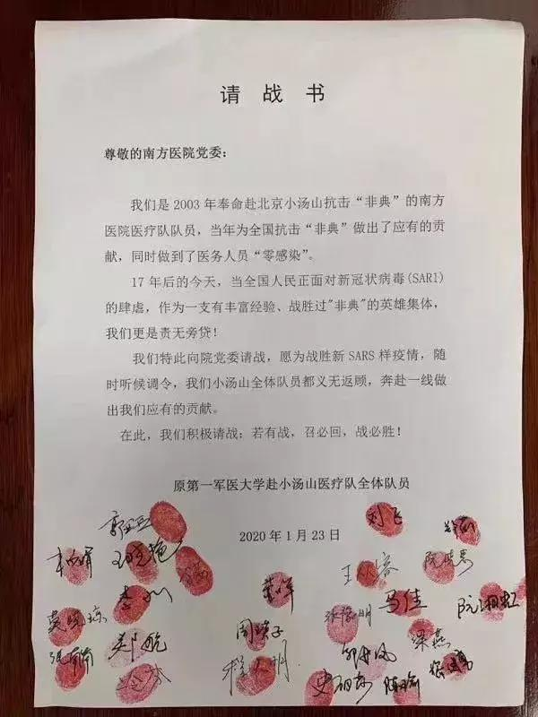
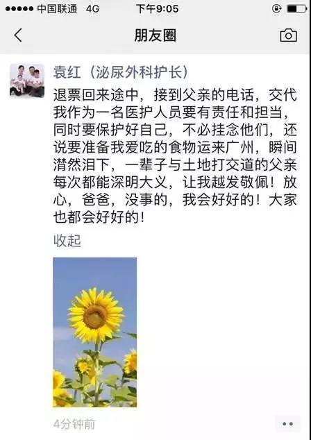

##正文

1月28日，在今天的疫情新闻发布会上医管局局长介绍，目前共4130位医护人员抵达湖北开展工作，到今晚，将有6000名来自全国各地的医务人员紧急驰援湖北，到抗击疫情的一线奋战。

听到这里，政事堂脑海里蹦出来两个字，稳了。

对比一下数据，截至今天凌晨，武汉发热门诊共接诊发热病人75221人，门诊留观3883人。

这6000来自祖国各地专业医护人员抵达的背后，意味着武汉一度被挤兑崩溃的医疗系统将完全恢复，也意味着有中国特色的饱和式防御网将正式建成。

这更意味着政事堂几天前最担心的“换防期”即将结束。

估计最迟后天，武汉新增的确诊病例将急速下滑，关于武汉的各类谣言也将丧失生存的土壤。

谣言的散去，病毒带来的全国性恐慌也将逐步淡去，因此，从医疗门诊到医护用品，这几天的疯狂挤兑潮也将过去。

随着医护人员和各类物资源源不断的向武汉涌入，武汉人民短暂的恐慌情绪散去，这场防疫战将进入“中国节奏”，就像当年的解放战争一样，我们把老蒋的军队分割包围，再集中优势兵力消灭。

而与此同时，我们也将开启一场新的战役，那就是经济战线。

俗话说大灾之后必有大疫，疫病若处理不好，危害往往比灾祸还严重，同样，大疫之后，我们也必须预防经济受到严重的冲击。

记得2003年非典，调海南王书记入京担任市长的原因之一，就是希望这位拥有丰富应对挤兑经验的官员，来收拾经贸摊子。

而市长上任没有多久，高盛老板，也就是后来的美国财长保尔森“完美逆行”来访中国，当时，《人民日报》海外版在头版头条称赞他“患难之中见英雄”。

因为我们要应对的，就是恐慌。这位后来中国人民的老朋友给美国的资本打了一针强劲的强心剂，在制止的外资撤离潮中体现了千金马骨的作用。

看看今天上午日本宣布要援华，就会明白深谙东方文化的邻居也在试图做“马骨”，而不出意外，这一两天韩国也会紧跟其后。

资本市场最怕挤兑，同样，这几天来，如果关注武汉新闻多的朋友，会发现真正对武汉造成冲击的，是恐慌带来的挤兑型就医。

短短几天之内，七万多人挤到十来个医院的发热门诊，大家可以算一下，门诊外长队的防护，需要消耗掉多少医用物资，面对排了几个小时队来就诊的患者们，医生们的心理压力有多大。

或者换个角度想一下，七万多人如果在春节期间排长龙跑去银行提款，也能轻松把武汉的一众银行乃至整个经济给挤兑崩溃了。

这也是政事堂为什么前几天，在各路援军抵达前，连续撰文抨击谣言。

如今，随着武汉挤兑型就医的解决，接下来我们要解决的，就是其他领域可能出现的挤兑。

拍脑袋都能想象的出来，目前市场上的不少谣言，都是一些囤货居奇之辈搞出来的，他们造谣言的目的，就是等着发一笔国难财。

就像前些年的蒜你狠、豆你玩、姜你军那样，一边造谣一边把价格拉起来，让广大民众也被迫参与囤货。

因此，从国家的层面上来看，打击囤货居奇只是一方面，接下来政府一定会从供给侧加大力度，推动生产补充库存，以求尽快内平抑各项重要物资的价格。

而另一个可能出现挤兑情况的，则是资本市场，我们要防止的，就是全国的股民也被疫病带来的恐慌去疯狂抛售，造成挤兑式的连环践踏式反应。

解决恐慌的最好方式，从疫病到资本市场的逻辑一样，就是加大供应。因此，节后开盘后，若出现恐慌式的抛售，那么国家队必然会出手拉盘，至于国家队喜欢拉什么，相信大家心里也都有数。

就像政事堂在节前文章《冠状病毒是否会改变一季度的小阳春？》预测的那样，小阳春本身并不会被改变，只是内部的组成结构会发生变化。

甚至政事堂猜测，由于为了防止物资出现挤兑影响民生与信心，在政府产能大爆发的推动下，今年一季度的GDP增速会大幅高于之前的预期。

尤其今年还是个暖冬，春暖花开时节的提早，将成为协助我们彻底扼杀病毒的最好帮手。

而这一套逻辑下来，就是政事堂为什么说，看到6000人驰援武汉，脑海里蹦出来两个字，稳了。

6000，虽然在新闻里只是一组数字。

可是他的背后，是上万名医护人员的一封封含泪写下的“请战书”，是他们挥别父母妻儿，去面对一场与死神对抗的战争。

 

而把这6000的数字逐一拆开，更是除夕夜一家人们围绕在留有空位的餐桌前，思念牵挂的那个人。
 
 

没有什么岁月静好，只因有人负重前行。

##留言区
 

