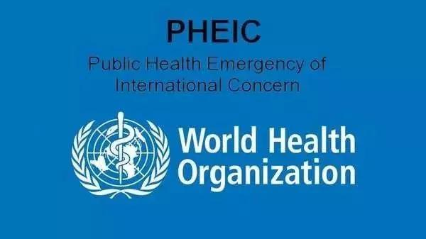

##正文

今天凌晨，世界卫生组织WHO宣布，将新型冠状病毒疫情列为“国际关注的突发公共卫生事件（PHEIC）”。

总干事谭德塞在当天的新闻发布会上表示，将新型冠状病毒疫情列为“国际关注的突发公共卫生事件”并不是因为中国的原因，而是因为其他国家的疫情变化。 

 

受此消息影响，今天上午，新加坡富时中国A50指数期货开盘涨超2%，美国三大股指尾盘也悉数由跌转涨。

只不过此时，中国的老百姓的手机上依然传播着所谓“疫区国”、“三年的旅行、贸易限制”，散播着焦虑的情绪。

其实，这都是谣言，在WHO总干事谭德塞的发言中，他说的很明确：

将疫情列为PHEIC，并非是由于中国防疫不力，相反，他对中国十分有信心，中国在过去一段时间的防疫措施“为全球都设立了新标准”。但是，为了支持医疗系统更脆弱的国家，WHO决定宣布PHEIC。

而且，谭德塞强调，WHO反对对中国采取旅行或贸易禁令。

这个表态是很重要的，这意味着拥有巨大贸易顺差的我们，所最担心的贸易禁令，没有了WHO给予的法理依据，如果进口国以疫情为由禁止中国货物入境，我们可以争取法律的保护。

这意味着除了极少数双方约定了疫情项的合同之外，根据WHO规定，对于拒绝货物入出境超过24小时的缔约国必须及时报备，这将保护中国出口企业的合法权益。

至于作为旅游逆差国的我们，自然不怕那些顺差国搞旅行禁令了。

不过，此次WHO认为可能存在的“全球爆发”，并非危言耸听。

在西方发达国家，拥有着庞大的医疗体系来应对，譬如美国疾病预防控制中心预计，在这个流感季，美国至少有1300万人感染，12万住院治疗和6600人死于流感，可人家有着奥巴马医保，得病也不当回事儿。

而在中国，面对病毒，我们可以用举国体制应对，今年春节期间，在庞大的基层党组织的推动下进行封锁，全国人民主动把自己隔离来消灭病毒。

但是，在东南亚、南亚以及撒哈拉以南的非洲等第三世界地区，既没有强力的政府组织，也没有庞大的医疗体系，一旦病毒爆发，后果将不堪设想。

这也是此次WHO发言中表达出来的意思，他们比中国人还相信中国有能力打赢这场疫情的包围战，但是对已经出现人传染人的第三世界国家则没什么信心，因此，希望中国的防疫经验，能够普及到其他的国家。

就像道德经说的，福祸相依。

这场疫病对中国的经济造成了巨大的冲击，但是，这也推动了我们内部的改革，让一批批尸位素餐的官员们离开岗位，推动医疗体制的改革。

当然，此次被列为PHEIC，被全球瞩目，经济损失自然是不可避免的，但是我们要做的，是尽可能的挽回损失。

在政治层面上，面对这场全球携手应对的疫病，我们推动高效而通明公开的政府，将以向全世界展示中国体制的合理与优势，粉碎敌对势力的谣言。

在经济层面上，随着研发出来的抗病毒中成药在抗击疫病中发挥作用，中国的传统中药也将以救世主的姿态亮相全球，创造一个新的产业。

谩骂和制造焦虑毫无意义，我们需要的是解决问题。

中华文明五千载，每一次灾难降临后的奋起，都只会让我们华夏儿女变得更强。

##留言区
 

