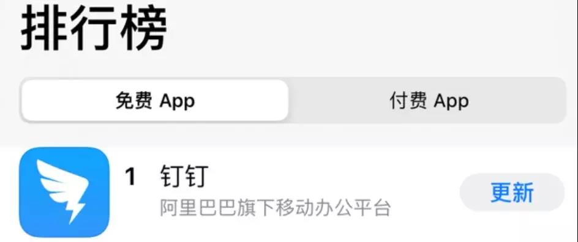
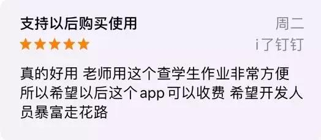
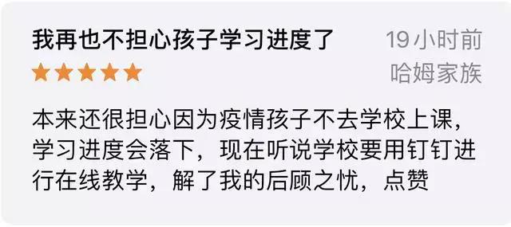
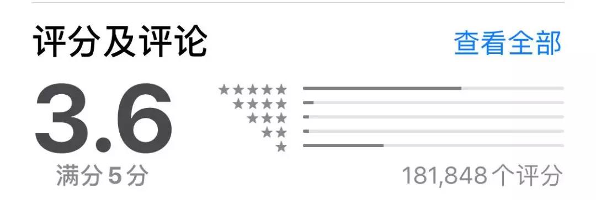

##正文

每年的春节，都是各大互联网公司的红包大战。

从支付宝的集福，到天猫、京东，抖音、快手，百度、头条，微视、微博，上百亿的补贴，打得那叫一个精彩纷呈。

不过今年的春节，谁也没想到各家筹备了数月，花费了巨额的资金，却被一款没有花钱的软件吊打了。

今年春节装机量第一的APP，竟然是马云麾下的办公软件钉钉。

 

因为这一轮大家都在家呆着，不仅有不少企业采用钉钉网上办公之外，全国上亿的师生也没法返校上课和批改寒假作业，于是，全国数十万所学校，纷纷选择了这款软件来代替。

在家就能授课和监督功课，这对于可以不用顶着病毒管理大批学生的老师来说，不仅带来方便，更重要的是安全。

 

而那些担心孩子进度会落下的家长们，自然也放宽了心，纷纷给出了五星好评。

 

不过，就像学生的妈妈们口口声声说着“打死不买了”，“再买剁手”，却依然捧着手机等着双十一的钟声清空购物车那样。学生们口口声声说着“我爱学习”、“谢谢这个软件”，大家却默默的的地给软件的平分打了下来。

 

没办法，大家还没睁开眼睛，就要和老师线上交流探讨学业……寒假作业加量不加价......自然是不爽的。

搞不好这个寒假过来，很多家庭的父子、父女关系会迅速融洽，因为他们有了“马爸爸”这个共同的吐槽对象。
 
 

不过呢，对此政事堂却看到了一场改变时代的教育互联网革命。

教育的互联网化，其规模化效应不仅能够大幅降低成本，更能够为那些偏远地区的教师和学生带来发达地区的优质教育资源，是个非常好的事情。

但是，这事儿就像网约车那样，如果没有互联网巨头们为了移动支付的入口，狂烧数百亿的补贴，也根本做不起来。

而在此次疫情之前，国内的几大教育巨头，不仅手头的钱不足烧出成绩，更头疼的是就算烧钱了，也可能是给他人做嫁衣。

因此，之前互联网教育就像网约车出行那样，没有初期的巨额补贴创造出来的供求关系，想坐网约车的没车可呼叫，想开网约车的没乘客可拉。

即使你做起来了，不仅有Uber这样的巨头虎视眈眈，还有庞大的出租车利益集团和监管在后面，任何一次事故都会被无限的放大。

同理，互联网教育也是这个逻辑，很多好老师平时时间都扑在课堂，没有精力把课程网络化，很多学生也没有习惯在网上上课，供求都有问题，更不要说各地方政府为了线下培训班的税收，并不喜欢搞教学的互联网化。

但是，这一轮大家一起在家呆着，蹲着蹲着，就把互联网教育的任督二脉都打通顺了。

全国数百万的老师因为没办法回校，纷纷开始尝试将课程网络化，因此必然会有一些金子散发出耀眼的光芒，进而被互联网的教育巨头们看中。

至于学生们，他们虽然在这个寒假很抵触网上教育，纷纷给软件打低分，但是相比于开春后线下的无穷无尽的兴趣班，大家习惯之后，还是在家线上听课相对舒服。

更不要说那些负责掏钱的家长，互联网化改造之后，可以随时跟踪孩子的学习情况，更能跟着孩子一起预习和复习，能够看到自己大把的钱都花在哪里。

在平台的搭建和供求的两旺之下，无论是那些望子成龙的家长，指望着学习改变命运的学生，还是想一战成名的老师，产业链上所有想要通过自身努力实现价值的群体，接下来都会纷纷在这里下赌注。

至于那些被资本催化出来的互联网巨头们，更不会放过这个机会，如果是政事堂负责的话，会让一大批的教育“星探”们，趁着老师们纷纷将课程搬到网上，而开始择优大规模签约扫货“签艺人”。

之后，利用互联网的流量开始扶持这些老师，展开一场教育内容的选秀，打造出一批闻名全国的知名教师。

最后，那些各种平台选秀过程中名利双收的老师们，其市场化的效应又会带动更多的优秀老师加入到互联网教育的行列，推动行业进入良性化的迅猛发展。

到时候，这些全国超级名师的带货能力，分分钟能让洛阳纸贵.......

而整个逻辑链条中最关键的，则是过去对互联网教育不怎么支持的监管，如今也得在大势面前松口。

供给有了，需求有了，监管打开了，那么互联网教育市场的迸发，就指日可待了。

传统的线下教育，恐怕即也面临改革的冲击，就像前天文章中说的那样：

大人，时代变了。

##留言区
 

